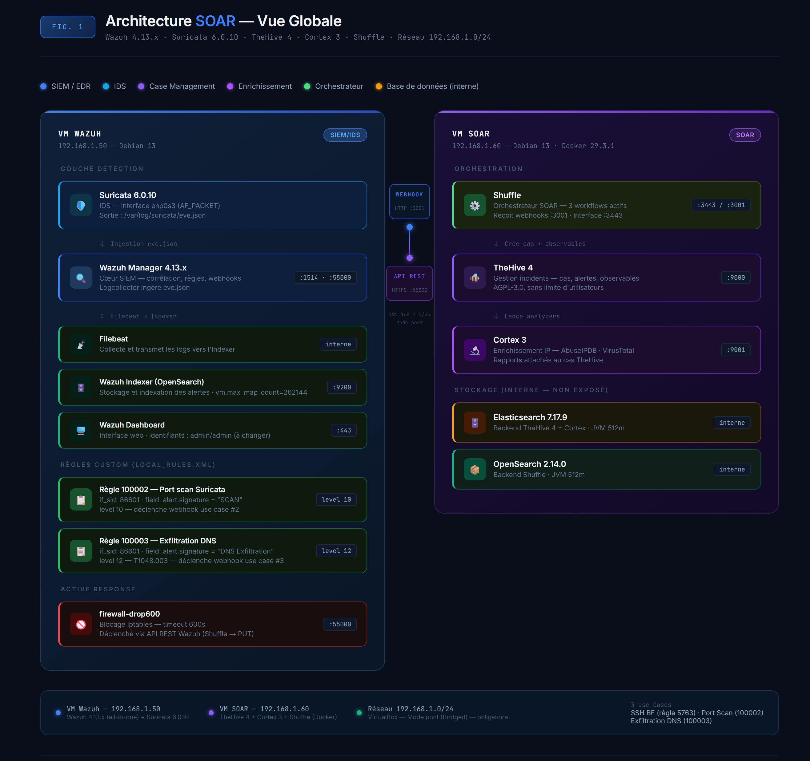
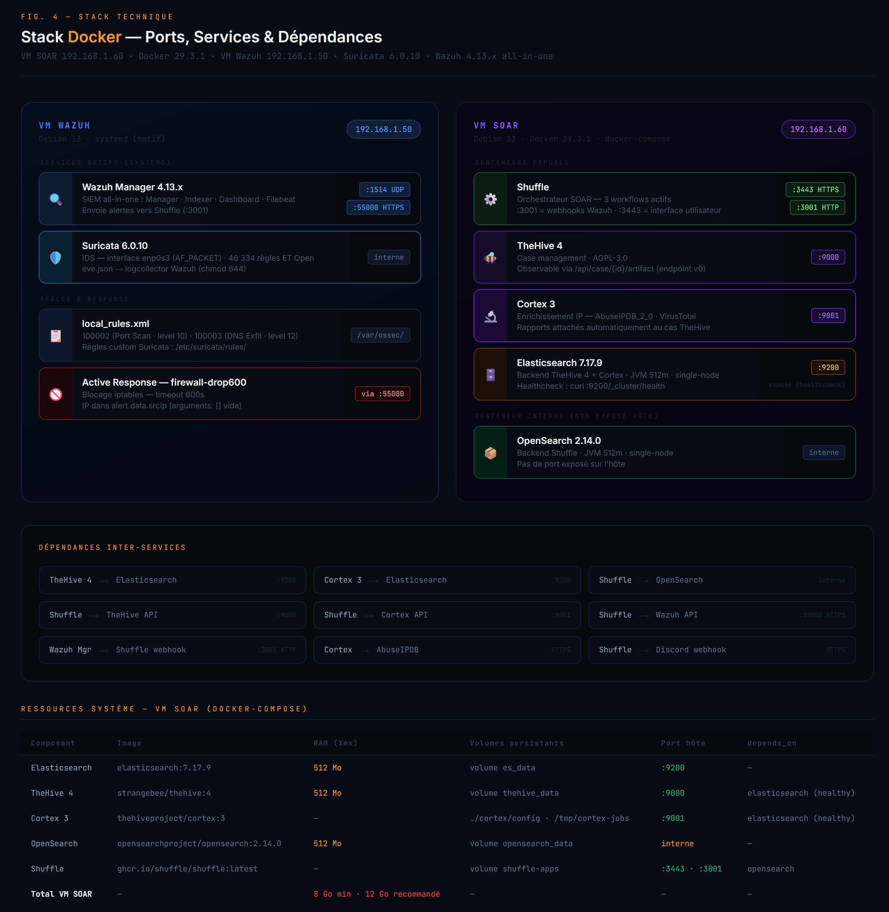
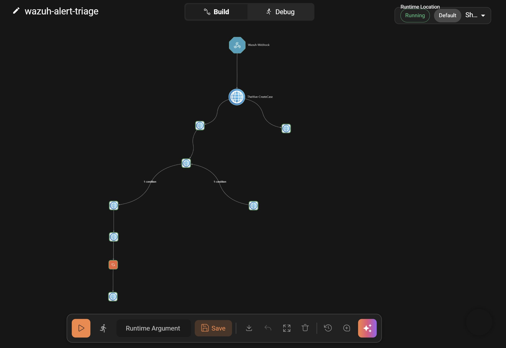
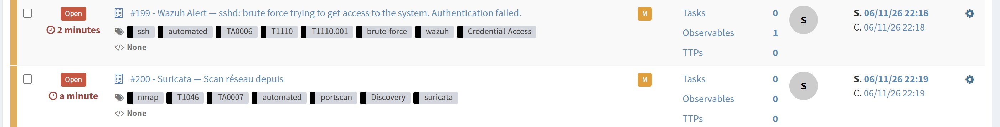
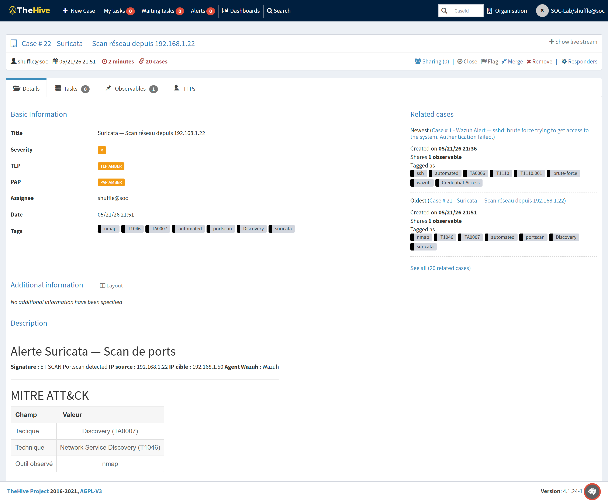
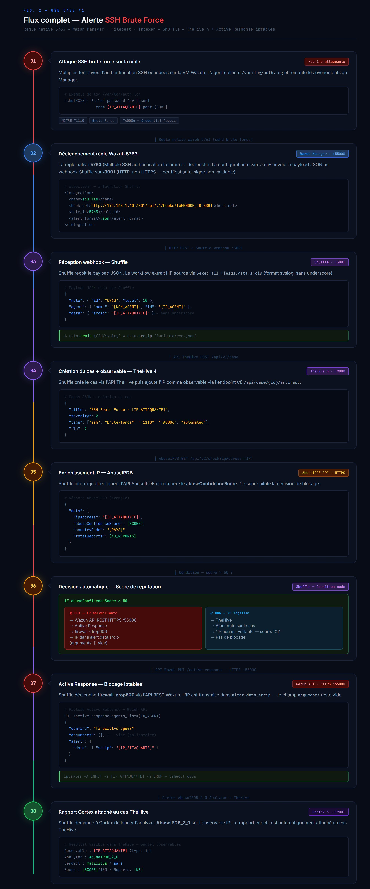
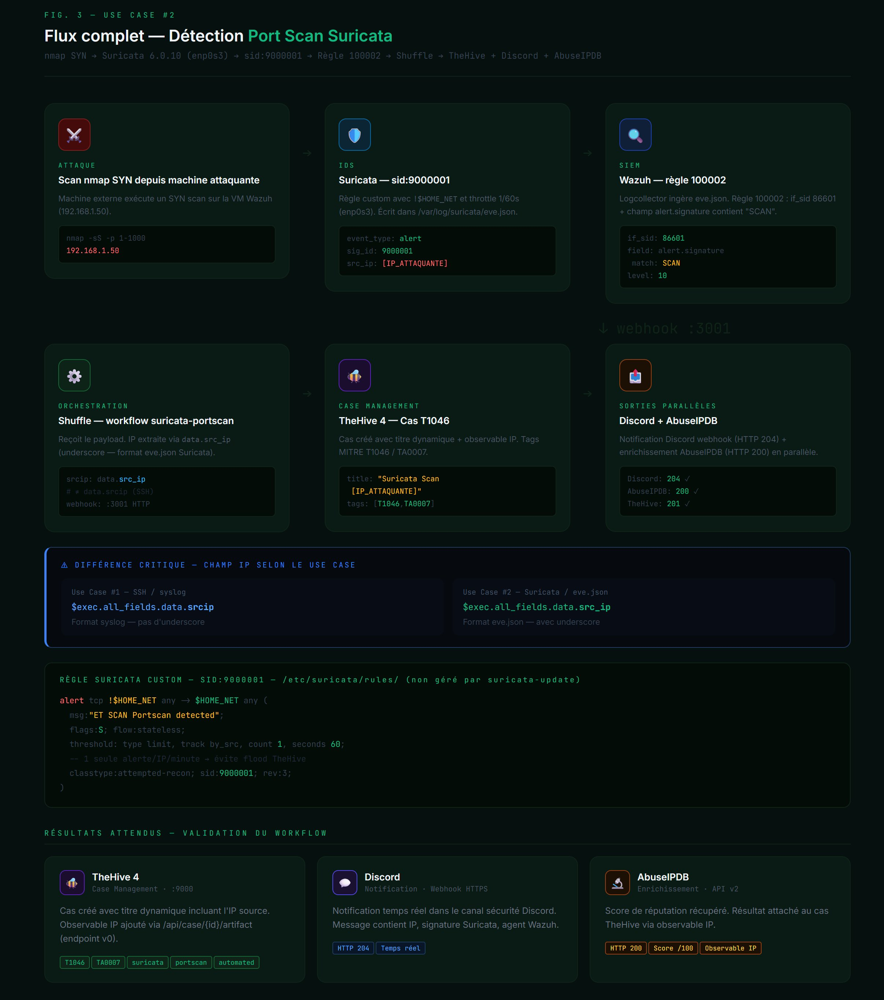
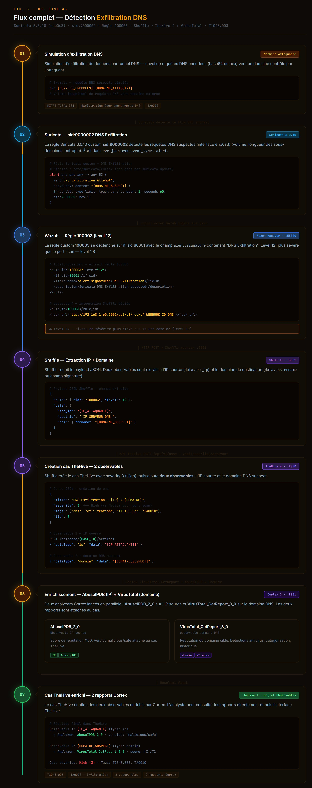
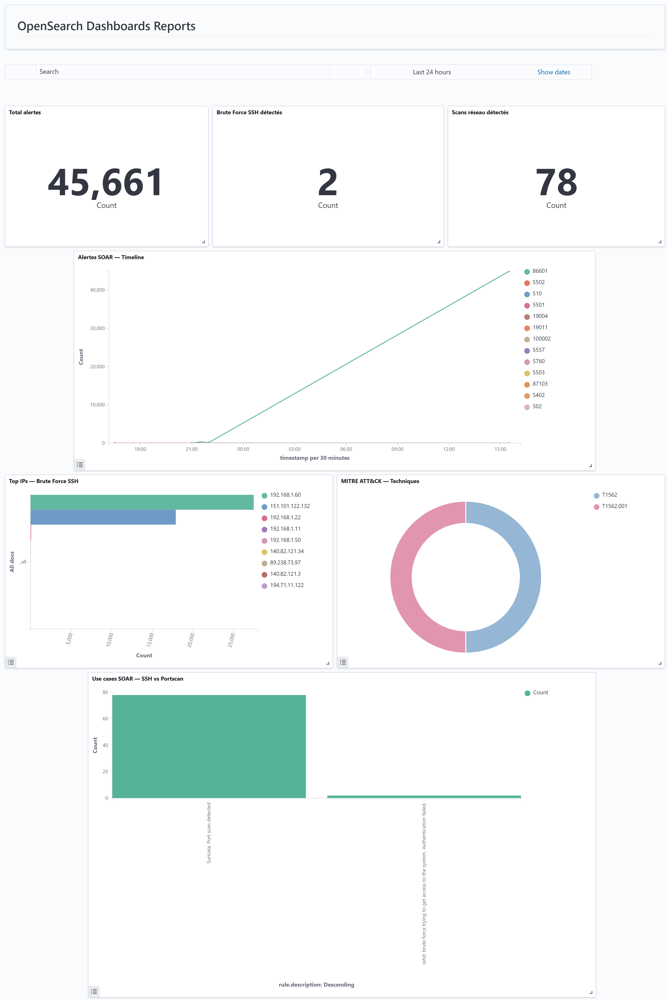
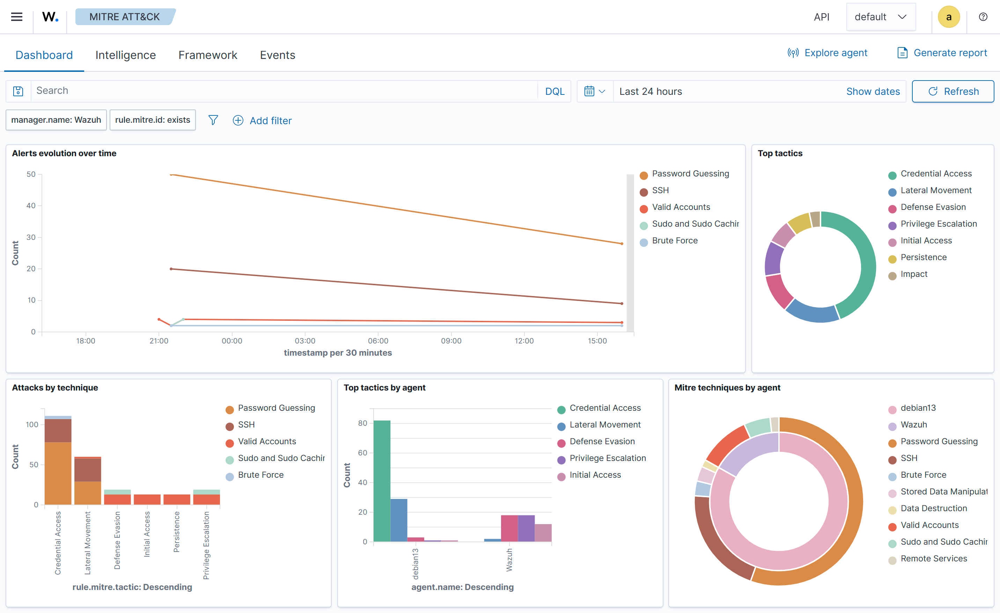

      
     

# SOAR — TheHive 4 · Cortex · Shuffle — Runbook

**Auteur :** Amélie Garnier — Étudiante en cybersécurité — Promotion 2025-2026 — Mai 2026  
**Formation :** M1 Expert Réseaux et Infrastructures Sécurisées — ORT Toulouse / 3iL Ingénieurs  
**Version :** v9.1 — Mai 2026  
**Stack :** Wazuh 4.13.x · Suricata 7.0.10 · TheHive 4 · Cortex 3 · Shuffle

---

## Contexte du projet

La prolifération des menaces informatiques impose des délais de réponse de plus en plus courts. Les outils de détection (SIEM, IDS) et de gestion d'incidents opèrent en silos : les alertes sont générées, mais leur traitement reste manuel, chronophage et sujet à l'erreur humaine.

Ce projet construit une **plateforme SOAR entièrement open source** automatisant la chaîne complète : détection par Wazuh et Suricata, blocage via iptables, création de cas dans TheHive, enrichissement IP via AbuseIPDB/Cortex, et notification Discord en temps réel.

Les composants sont répartis sur deux machines virtuelles : la **VM Wazuh** (`192.168.1.50`) et la **VM SOAR** (`192.168.1.60`).

L'essentiel du travail a porté sur la résolution de problèmes non documentés — port webhook 3001 vs 3443, variable parasite Shuffle `.0.`, srcip vs src_ip Suricata, erreur Active Response 1652 sans `rules_id`, crash TheHive `--es-uri` — et sur la construction d'une automatisation fiable de bout en bout.

---

## Objectifs

- Réduire le **MTTD < 30 s** et le **MTTR < 2 min** via des workflows automatisés
- Éliminer les interventions manuelles répétitives avec Shuffle
- Enrichir chaque alerte avec un **score AbuseIPDB** pour des décisions de blocage documentées
- Tracer chaque incident dans TheHive avec **observables et tags MITRE ATT&CK**
- Démontrer la viabilité d'une **stack SOAR full open source** sans coûts de licence

---

## Architecture



```
┌─────────────────────────────┐     ┌─────────────────────────────────────┐
│   VM Wazuh — 192.168.1.50   │     │      VM SOAR — 192.168.1.60          │
│                             │     │                                      │
│  Suricata 7.0.10            │     │  ┌──────────┐   ┌───────────────┐   │
│    └─► eve.json             │     │  │ TheHive 4│   │   Cortex 3    │   │
│                             │     │  │  :9000   │   │    :9001      │   │
│  Wazuh Manager 4.13         │─────►  └──────────┘   └───────────────┘   │
│    └─► webhook HTTP :3001   │     │                                      │
│                             │     │  ┌──────────────────────────────┐   │
│  Active Response (iptables) │◄────│  │        Shuffle               │   │
│                             │     │  │     :3443 / :3001            │   │
└─────────────────────────────┘     │  └──────────────────────────────┘   │
                                    └─────────────────────────────────────┘
```



| VM | IP | OS | Rôle |
|----|----|----|----- |
| VM Wazuh | 192.168.1.50 | Debian 13 | Wazuh 4.13 + Suricata 7.0.10 |
| VM SOAR | 192.168.1.60 | Debian 13 | TheHive 4 + Cortex 3 + Shuffle |
| VM Zabbix | 192.168.1.61 | Debian 13 | Zabbix Server 7.0 + supervision |

---

## Services supervisés

### VM SOAR (192.168.1.60) et VM Wazuh (192.168.1.50)

| Service | Port | Seuil |
|---------|------|-------|
| wazuh-manager | TCP 1514 | Down > 1 min → **Désastre** |
| wazuh-indexer | TCP 9200 | Down > 1 min → **Haut** |
| thehive | TCP 9000 | Down > 1 min → **Haut** |
| cortex | TCP 9001 | Down > 1 min → **Haut** |
| shuffle-frontend | TCP 3443 | Down > 1 min → **Moyen** |
| RAM | Agent | > 90% |
| CPU | Agent | > 85% pendant 5 min |
| Disque | Agent | > 80% |

---

## Flux de traitement des alertes

```
[Wazuh 192.168.1.50]
  Suricata → eve.json → Wazuh Manager
      │ webhook HTTP (port 3001)
      ▼
[Shuffle 192.168.1.60]
    ├──► TheHive (case + observable IP créés automatiquement)
    ├──► Discord (notification temps réel)
    ├──► AbuseIPDB (enrichissement IP)
    ├──► Condition score > 50 ?
    │       ├── OUI → Wazuh API → Active Response (blocage iptables)
    │       └── NON → TheHive (note "IP non malveillante")
    └──► Cortex → AbuseIPDB analyzer (rapport dans TheHive)
```

**Workflow Shuffle — wazuh-alert-triage**



**Cases TheHive générés automatiquement**



**Détail d'un case TheHive (Suricata Scan de ports)**



---

## Use cases implémentés

| # | Attaque | Détection | MITRE | Réponse automatique |
|---|---------|-----------|-------|---------------------|
| 1 | Brute Force SSH (Hydra) | Wazuh règle 5763 | T1110 / TA0006 | Blocage iptables via Active Response |
| 2 | Scan de ports (nmap) | Suricata sid:9000001 + Wazuh règle 100002 | T1046 / TA0007 | Case TheHive + notification Discord |
| 3 | Exfiltration DNS | Suricata sid:9000002 + Wazuh règle 100003 | T1048.003 / TA0010 | Case TheHive severity H, TLP:RED |

**Use Case #1 — Flux complet Brute Force SSH**



**Use Case #2 — Flux complet Port Scan Suricata**



**Use Case #3 — Flux complet Exfiltration DNS**



---

## Contenu du dépôt

| Fichier | Description |
|---------|-------------|
| [`runbook-soar-v9.md`](./runbook-soar-v9.md) | Runbook complet — installation, configurations, alertes, troubleshooting |

---

## Prérequis

- VM Wazuh et SIEM opérationnels (voir runbook précédent)
- VM SOAR — Debian 13, 8 Go RAM minimum, réseau **en mode pont (bridged)**
- Docker Engine + Docker Compose installés
- Clés API gratuites : **AbuseIPDB** (1 000 req/jour) et **VirusTotal** (500 req/jour)
- Webhook Discord créé dans le channel de notification

---

## Démarrage rapide

Consulter le runbook complet : [runbook-soar-v9.md](./runbook-soar-v9.md)

Steps principales :

1. Préparer la VM SOAR (Debian 13, mode pont)
2. Installer Docker et configurer `vm.max_map_count=262144`
3. Déployer TheHive 4 + Cortex via `docker compose up -d`
4. Configurer la liaison TheHive → Cortex via `application.conf`
5. Déployer Shuffle et configurer `OUTER_HOSTNAME` + `BASE_URL`
6. Créer l'organisation SOC-Lab dans TheHive et générer les API keys
7. Configurer les intégrations Wazuh → Shuffle (webhooks sur port 3001)
8. Construire les workflows dans Shuffle (wazuh-alert-triage, suricata-portscan-triage, dns-exfil-triage)
9. Activer les analyzers AbuseIPDB et VirusTotal dans Cortex
10. Configurer l'Active Response sur Wazuh (3 blocs obligatoires dans ossec.conf)

---

## Stack technique

| Composant | Version | Usage |
|-----------|---------|-------|
| Wazuh | 4.13.x | SIEM + Active Response |
| Suricata | 7.0.10 | IDS réseau |
| TheHive | 4 (AGPL) | Gestion des incidents |
| Cortex | 3 | Enrichissement automatique |
| Shuffle | latest | Orchestration SOAR |
| Elasticsearch | 7.17.9 | Base de données TheHive + Cortex |
| OpenSearch | 2.14.0 | Base de données Shuffle |
| Docker Compose | v2 | Déploiement conteneurisé |
| Debian | 13 | OS des deux VMs |

---

## Alertes Discord

Les alertes sont envoyées sur Discord via webhook (`application/x-www-form-urlencoded`) directement depuis Shuffle.

Informations incluses : IP source, cible, règle Wazuh / signature Suricata, ID du case TheHive, score AbuseIPDB, statut du blocage.

---

## Dashboards

**Dashboard OpenSearch — Alertes SOAR en temps réel**



**Dashboard Wazuh — MITRE ATT&CK**



---

## Bilan

Ce projet démontre qu'une plateforme SOAR complète peut être construite avec des outils open source. Les trois use cases validés couvrent des vecteurs d'attaque réels.

| KPI | Valeur mesurée | Objectif |
|-----|---------------|----------|
| MTTD | **20 s** | < 30 s ✅ |
| MTTR | **< 1 s** | < 120 s ✅ |
| Taux de blocage automatique | **100 %** | > 80 % ✅ |
| Disponibilité stack | **100 %** | > 99 % ✅ |

| Objectif | Statut |
|---|---|
| Stack SOAR déployée via Docker (TheHive 4 + Cortex + Shuffle) | ✅ Atteint |
| Use case #1 — Brute Force SSH détecté et bloqué automatiquement | ✅ Atteint |
| Use case #2 — Scan de ports Suricata → case TheHive T1046/TA0007 | ✅ Atteint |
| Use case #3 — Exfiltration DNS → case TheHive T1048.003/TA0010 | ✅ Atteint |
| Enrichissement AbuseIPDB via Cortex | ✅ Atteint |
| Notification Discord temps réel | ✅ Atteint |
| KPI MTTD/MTTR mesurés sur runs réels | ✅ Atteint |
| Script healthcheck automatisé (`check_stack.sh`) | ✅ Atteint |
| Script de démonstration `soar-demo.sh` (ssh \| scan \| dns \| all) | ✅ Atteint |

---

## Perspectives d'amélioration

- **Gestion des secrets (L3-2) :** clés API dans un fichier `.env` chiffré via GPG (AES-256) et injectées via Docker secrets — les credentials disparaissent des nœuds Shuffle et des logs.
- **Playbook de fermeture de case (L3-3) :** script cron horaire qui re-vérifie l'IP source via AbuseIPDB après 24h et ferme automatiquement le case si le score est inférieur à 10, démontrant un cycle de vie complet sans intervention manuelle.
- **Intégration Zabbix → GLPI dans Shuffle :** tickets GLPI automatiques sur alerte supervision, avec case TheHive parallèle si une IP est impliquée — traçabilité unifiée IT/Sécurité.
- **Enrichissement VirusTotal :** analyzer Cortex pour les indicateurs de hachage (T1204) et authentification renforcée avec compte API Wazuh dédié.
- **IA agent locale :** nœud Shuffle Ollama + Mistral analysant le payload Wazuh et générant automatiquement un résumé d'investigation dans la description du case TheHive, sans API cloud propriétaire.

---

## Auteur

**Amélie Garnier** — [@ameliegarnier](https://github.com/ameliegarnier)
