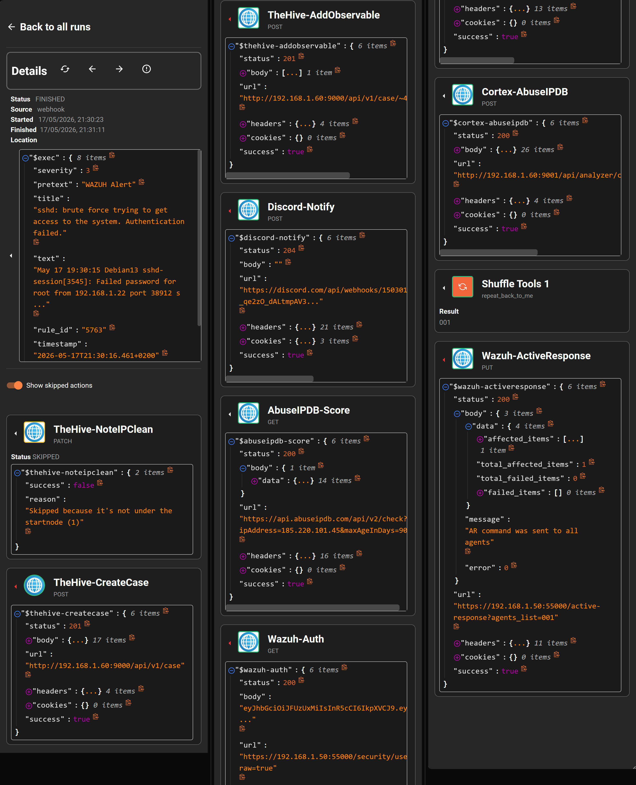
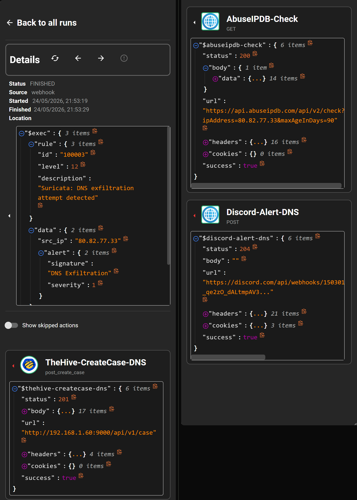
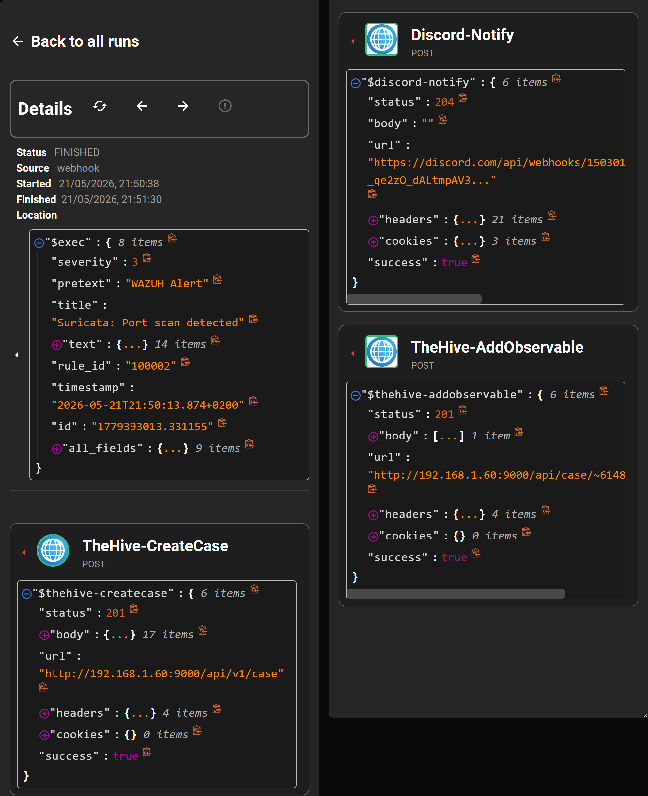
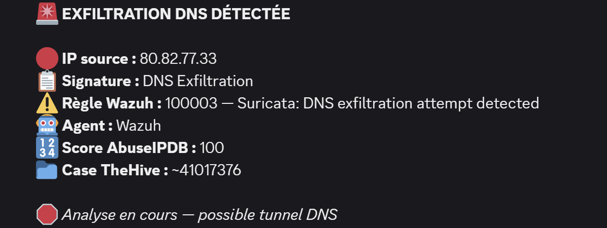

# Runbook SOAR — TheHive 4 + Cortex + Shuffle (v12)

> **Architecture 2 VMs :**
> - **VM Wazuh** : `192.168.1.50` — Wazuh 4.13.x + Suricata 7.0.10
> - **VM SOAR** : `192.168.1.60`
>
> **Prérequis :** Wazuh et Suricata opérationnels (voir runbooks précédents)
> **Stack SOAR :** TheHive 4 + Cortex 3 + Shuffle — déployés via Docker sur la VM SOAR

---

## Présentation de la stack SOAR

| Composant | Rôle | Port | VM |
|-----------|------|------|----|
| **Shuffle** | Orchestrateur SOAR — workflows automatisés | 3443 (HTTPS) | SOAR |
| **TheHive 4** | Gestion des incidents et des cas de sécurité | 9000 | SOAR |
| **Cortex** | Enrichissement automatique — AbuseIPDB, VirusTotal | 9001 | SOAR |
| **Elasticsearch** | Base de données TheHive + Cortex | interne | SOAR |
| **OpenSearch** | Base de données Shuffle | interne | SOAR |
| **Wazuh Manager** | SIEM — corrélation des alertes, envoi webhook | — | Wazuh |

> ℹ️ **Pourquoi TheHive 4 et non TheHive 5 ?**
> TheHive 5 (StrangeBee) est limité à **2 utilisateurs actifs** en version gratuite.
> TheHive 4 est 100% **open source (AGPL-3.0)**, sans restriction d'utilisateurs.
> Il n'utilise **pas Cassandra** — Elasticsearch seul suffit, ce qui simplifie la stack et réduit la consommation RAM.

### Flux complet

```
[VM Wazuh 192.168.1.50]
  Suricata → eve.json → Wazuh logcollector → Wazuh Manager
      │
      │  webhook HTTP
      ▼
[VM SOAR 192.168.1.60]
  Shuffle
    ├──► TheHive (case + observable IP créés automatiquement)
    ├──► AbuseIPDB (enrichissement IP)
    ├──► Condition score > 50 ?
    │       ├── OUI → Wazuh API → Active Response (blocage iptables)
    │       └── NON → TheHive (note "IP non malveillante")
    └──► Cortex → AbuseIPDB analyzer (rapport dans TheHive)
```

### Matrice de décision — choix des outils

| Composant | Outil retenu | Score | Alternative écartée |
|---|---|---|---|
| Orchestrateur SOAR | Shuffle | 24/30 | n8n (17/30) — pas de connecteurs natifs TheHive |
| Gestion incidents | TheHive 4 | — | TheHive 5 — limite 2 users, Cassandra requis |
| SIEM/EDR | Wazuh | — | Splunk — propriétaire, 8+ Go RAM |
| Enrichissement | Cortex 3 | — | HTTP direct — pas de traçabilité dans TheHive |

---

## Table des matières

1. [Création et préparation de la VM SOAR](#1-création-et-préparation-de-la-vm-soar)
2. [Installation de Docker](#2-installation-de-docker)
3. [Déploiement TheHive 4 + Cortex](#3-déploiement-thehive-4--cortex)
4. [Déploiement Shuffle](#4-déploiement-shuffle)
5. [Vérifier la connectivité entre les deux VMs](#5-vérifier-la-connectivité-entre-les-deux-vms)
6. [Configuration Active Response sur Wazuh](#6-configuration-active-response-sur-wazuh)
7. [Connexion Wazuh → Shuffle (webhooks)](#7-connexion-wazuh--shuffle-webhooks)
8. [Configuration TheHive et Cortex](#8-configuration-thehive-et-cortex)
9. [Construction du workflow Shuffle — Use case #1 Brute Force SSH](#9-construction-du-workflow-shuffle--use-case-1-brute-force-ssh)
10. [Activation des analyzers Cortex](#10-activation-des-analyzers-cortex)
11. [Test de validation — Attaque brute force SSH avec Hydra](#11-test-de-validation--attaque-brute-force-ssh-avec-hydra)
12. [Test complet de la chaîne SOAR](#12-test-complet-de-la-chaîne-soar)
13. [Supervision avec Zabbix](#13-supervision-avec-zabbix)
    - [13.6 Intégration Zabbix → Shuffle — workflow zabbix-alert-triage](#136-intégration-zabbix--shuffle--workflow-zabbix-alert-triage)
14. [Opérations courantes](#14-opérations-courantes)
15. [Troubleshooting](#15-troubleshooting)
16. [Améliorations Niveau 1 — Maturité professionnelle](#16-améliorations-niveau-1--maturité-professionnelle)
17. [Améliorations Niveau 2 — Use case #2 Scan de ports Suricata](#17-améliorations-niveau-2--use-case-2-scan-de-ports-suricata)
18. [Améliorations Niveau 3 — Version avancée](#18-améliorations-niveau-3--version-avancée)

---

## 1. Création et préparation de la VM SOAR

### Specs VirtualBox

| Ressource | Valeur |
|-----------|--------|
| OS | Debian 13 64-bit |
| RAM | 8 Go minimum (12 Go recommandés) |
| CPU | 4 cœurs |
| Disque | 50 Go minimum |
| Réseau | **Mode pont (Bridged) — obligatoire** |

> ⚠️ Le réseau **doit être en mode pont**. Sans ça, la VM SOAR et la VM Wazuh ne peuvent pas communiquer.

### Récupérer l'IP de la VM SOAR

```bash
ip a | grep "inet " | grep -v 127
```

### Préparer le système

```bash
sudo -i
export PATH=$PATH:/sbin:/usr/sbin
echo 'export PATH=$PATH:/sbin:/usr/sbin' >> /root/.bashrc
echo "nameserver 8.8.8.8" >> /etc/resolv.conf
apt update && apt upgrade -y
apt install -y curl gnupg micro jq procps
```

### Paramètre noyau requis

Elasticsearch et OpenSearch refusent de démarrer sans ce paramètre.

```bash
sysctl -w vm.max_map_count=262144
echo "vm.max_map_count=262144" >> /etc/sysctl.conf
sysctl vm.max_map_count
# → 262144
```

---

## 2. Installation de Docker

> Sur la **VM SOAR**.

```bash
apt install -y ca-certificates curl gnupg lsb-release

install -m 0755 -d /etc/apt/keyrings
curl -fsSL https://download.docker.com/linux/debian/gpg \
  | gpg --dearmor -o /etc/apt/keyrings/docker.gpg
chmod a+r /etc/apt/keyrings/docker.gpg

echo \
  "deb [arch=$(dpkg --print-architecture) signed-by=/etc/apt/keyrings/docker.gpg] \
  https://download.docker.com/linux/debian \
  $(. /etc/os-release && echo "$VERSION_CODENAME") stable" \
  | tee /etc/apt/sources.list.d/docker.list > /dev/null

apt update
apt install -y docker-ce docker-ce-cli containerd.io docker-buildx-plugin docker-compose-plugin

systemctl enable docker
systemctl start docker
```

---

## 3. Déploiement TheHive 4 + Cortex

> Sur la **VM SOAR**.

### Préparer les répertoires

```bash
mkdir -p ~/soar-stack/thehive/config
mkdir -p ~/soar-stack/cortex/config
mkdir -p /tmp/cortex-jobs
chmod 777 /tmp/cortex-jobs
cd ~/soar-stack
```

### Créer les fichiers de configuration Cortex

> ⚠️ **Étape obligatoire.** Sans ces fichiers, Cortex crashe silencieusement au démarrage.

```bash
cat > ~/soar-stack/cortex/config/logback.xml << 'EOF'
<configuration>
  <conversionRule conversionWord="coloredLevel" converterClass="play.api.libs.logback.ColoredLevel" />
  <appender name="STDOUT" class="ch.qos.logback.core.ConsoleAppender">
    <encoder>
      <pattern>%date [%level] from %logger in %thread - %message%n%xException</pattern>
    </encoder>
  </appender>
  <logger name="play" level="INFO" />
  <logger name="application" level="INFO" />
  <root level="INFO">
    <appender-ref ref="STDOUT" />
  </root>
</configuration>
EOF

cat > ~/soar-stack/cortex/config/application.conf << 'EOF'
search {
  uri = "http://elasticsearch:9200"
}
job {
  directory = /tmp/cortex-jobs
}
EOF
```

### Nettoyer les éventuels containers orphelins

> ⚠️ Si tu migres depuis une ancienne stack TheHive 5, Cassandra peut tourner en arrière-plan.
> TheHive 4 le détecterait et tenterait de s'y connecter au lieu d'Elasticsearch → crash en boucle.

```bash
docker compose down
docker rm -f cassandra 2>/dev/null || true

# Vérifier qu'il ne reste aucune trace
docker ps -a | grep cassandra
grep -n "cassandra" ~/soar-stack/docker-compose.yml
# → les deux commandes doivent retourner vide
```

### Créer le fichier docker-compose.yml

> ⚠️ Heap TheHive réduite à `-Xms512m -Xmx512m` pour éviter le CPU starvation sur VM avec RAM limitée.

```bash
cat > ~/soar-stack/docker-compose.yml << 'EOF'
services:

  elasticsearch:
    image: docker.elastic.co/elasticsearch/elasticsearch:7.17.9
    container_name: elasticsearch
    environment:
      - discovery.type=single-node
      - xpack.security.enabled=false
      - "ES_JAVA_OPTS=-Xms512m -Xmx512m"
    volumes:
      - es_data:/usr/share/elasticsearch/data
    restart: unless-stopped
    healthcheck:
      test: ["CMD", "curl", "-f", "http://localhost:9200"]
      interval: 30s
      timeout: 10s
      retries: 5

  thehive:
    image: thehiveproject/thehive4:latest
    container_name: thehive
    depends_on:
      elasticsearch:
        condition: service_healthy
    ports:
      - "9000:9000"
    environment:
      - "JVM_OPTS=-Xms512m -Xmx512m"
    volumes:
      - thehive_data:/opt/thehive/data
    restart: unless-stopped

  cortex:
    image: thehiveproject/cortex:3
    container_name: cortex
    depends_on:
      elasticsearch:
        condition: service_healthy
    ports:
      - "9001:9001"
    environment:
      - job_directory=/tmp/cortex-jobs
    volumes:
      - ./cortex/config:/etc/cortex
      - /var/run/docker.sock:/var/run/docker.sock
      - /tmp/cortex-jobs:/tmp/cortex-jobs
      - ./cortex/Cortex-Analyzers:/opt/cortex/neurons
    restart: unless-stopped

volumes:
  es_data:
  thehive_data:
EOF
```

### Lancer la stack

```bash
cd ~/soar-stack
docker compose up -d
watch docker compose ps
docker compose logs -f thehive
# Attendre "Listening for HTTP on /0.0.0.0:9000"
```

### Vérifier l'accès

```bash
curl -s http://localhost:9000/api/status | jq .versions
curl -s http://localhost:9001/api/status
```

| Interface | URL | Identifiants par défaut |
|-----------|-----|------------------------|
| TheHive | http://192.168.1.60:9000 | `admin@thehive.local` / `secret` |
| Cortex | http://192.168.1.60:9001 | À créer au premier accès |

---

## 4. Déploiement Shuffle

> Sur la **VM SOAR**.

### Cloner le dépôt

```bash
cd ~/soar-stack
git clone https://github.com/Shuffle/Shuffle shuffle-deploy
cd shuffle-deploy
```

### Forcer la version OpenSearch compatible

```bash
sed -i 's|opensearchproject/opensearch:.*|opensearchproject/opensearch:2.14.0|g' docker-compose.yml
grep opensearch docker-compose.yml | grep image
# → image: opensearchproject/opensearch:2.14.0
```

### Configurer le fichier .env

> ⚠️ `OUTER_HOSTNAME` doit être l'IP réelle, pas `shuffle-backend`.

```bash
sed -i 's/OUTER_HOSTNAME=shuffle-backend/OUTER_HOSTNAME=192.168.1.60/' .env
sed -i 's|BASE_URL=http://shuffle-backend:5001|BASE_URL=https://192.168.1.60:3443|' .env

grep -E "OUTER_HOSTNAME|BASE_URL" .env
# → BASE_URL=https://192.168.1.60:3443
# → OUTER_HOSTNAME=192.168.1.60

# Mot de passe OpenSearch obligatoire depuis 2.12+
echo "OPENSEARCH_INITIAL_ADMIN_PASSWORD=Shuffle@Admin1234!" >> .env
```

### Préparer et lancer

```bash
swapoff -a
docker run --rm -v shuffle-deploy_shuffle-database:/data busybox chown -R 1000:1000 /data
docker compose up -d
sleep 60
docker compose logs opensearch | grep -i "started" | tail -3
```

### Accès à Shuffle

```
✅ https://192.168.1.60:3443   ← correct (accepter le cert auto-signé)
❌ http://192.168.1.60:3001    ← redirige vers GitHub
```

Au premier accès, créer un compte administrateur directement dans l'interface.

---

## 5. Vérifier la connectivité entre les deux VMs

```bash
# VM SOAR → VM Wazuh
ping -c 3 192.168.1.50
curl -k -s https://192.168.1.50:55000/ | jq .title
# → "Wazuh API REST"

# VM Wazuh → VM SOAR
ping -c 3 192.168.1.60
curl -s http://192.168.1.60:9000/api/status | jq .versions
```

---

## 6. Configuration Active Response sur Wazuh

> Sur la **VM Wazuh** (`192.168.1.50`).

### 6.1 Configurer le Manager (ossec.conf)

```bash
micro /var/ossec/etc/ossec.conf
```

La section `<active-response>` doit contenir **trois blocs** :

```xml
<!-- Bloc 1 : déclenchement sur règle custom -->
<active-response>
  <command>firewall-drop</command>
  <location>local</location>
  <rules_id>100100</rules_id>
  <timeout>600</timeout>
</active-response>

<!-- Bloc 2 : déclenchement sur brute force SSH -->
<active-response>
  <disabled>no</disabled>
  <command>firewall-drop</command>
  <location>local</location>
  <rules_id>5763</rules_id>
  <timeout>600</timeout>
</active-response>

<!-- Bloc 3 : OBLIGATOIRE pour le déclenchement via API Wazuh (Shuffle) -->
<active-response>
  <command>firewall-drop</command>
  <location>local</location>
  <timeout>600</timeout>
</active-response>
```

> ⚠️ Le **bloc 3 sans `<rules_id>`** est indispensable pour que l'API puisse déclencher l'Active Response depuis Shuffle. Sans lui → erreur `1652`.

```bash
systemctl restart wazuh-manager
```

### 6.2 Configurer l'agent Linux (ossec.conf sur chaque agent)

```xml
<command>
  <name>firewall-drop</name>
  <executable>firewall-drop</executable>
  <timeout_allowed>yes</timeout_allowed>
</command>

<active-response>
  <command>firewall-drop</command>
  <location>local</location>
  <timeout>600</timeout>
</active-response>
```

```bash
systemctl restart wazuh-agent
```

### 6.3 S'assurer qu'iptables est dans le PATH de l'agent

```bash
which iptables || echo "introuvable"

# Si introuvable :
echo 'PATH=/usr/local/sbin:/usr/local/bin:/usr/sbin:/usr/bin:/sbin:/bin' >> /etc/environment
export PATH=$PATH:/usr/sbin
systemctl restart wazuh-agent
```

### 6.4 Vérifier le fichier ar.conf

```bash
cat /var/ossec/etc/shared/ar.conf
# → doit contenir "firewall-drop600 - firewall-drop - 600" sans rules_id
```

### 6.5 Tester l'Active Response via l'API

> ⚠️ Le nom de commande dans l'API est `firewall-drop600` (pas `firewall-drop`).
> L'IP doit être dans `alert.data.srcip`, pas dans `arguments`.

```bash
curl -k -s -X PUT \
  -H "Authorization: Bearer $(curl -k -s -u wazuh-wui:wazuh-wui 'https://192.168.1.50:55000/security/user/authenticate?raw=true')" \
  -H "Content-Type: application/json" \
  "https://192.168.1.50:55000/active-response?agents_list=003" \
  -d '{"command":"firewall-drop600","arguments":[],"alert":{"data":{"srcip":"1.2.3.4"}}}'

# Résultat attendu :
# {"affected_items": ["003"], "total_affected_items": 1, "total_failed_items": 0}

# Vérifier sur l'agent
tail -5 /var/ossec/logs/active-responses.log
iptables -L -n | grep 1.2.3.4
```

---

## 7. Connexion Wazuh → Shuffle (webhooks)

Shuffle expose **deux ports distincts** :

| Port | Protocole | Usage |
|------|-----------|-------|
| `3443` | HTTPS | Interface web — navigateur |
| `3001` | HTTP | Réception des webhooks — machines |

> ⚠️ Toujours utiliser **`http://` port `3001`** pour les webhooks Wazuh. Wazuh ne peut pas valider le certificat auto-signé de Shuffle sur le port 3443 — la connexion échoue silencieusement.

### Créer les webhooks dans Shuffle

Pour chaque workflow :

1. `https://192.168.1.60:3443` → **Workflows** → **+ Create Workflow**
2. Cliquer sur le nœud **Webhook** → copier l'URL
3. Activer le workflow (toggle vert en haut à droite)

URL format : `http://192.168.1.60:3001/api/v1/hooks/webhook_XXXXXXXX`

### Configurer les intégrations dans Wazuh

```bash
micro /var/ossec/etc/ossec.conf
```

Ajouter les deux blocs `<integration>` dans `<ossec_config>` :

```xml
<!-- Use case #1 — Brute force SSH → workflow wazuh-alert-triage -->
<integration>
  <name>shuffle</name>
  <hook_url>http://192.168.1.60:3001/api/v1/hooks/webhook_XXXXXXXX</hook_url>
  <rule_id>5763</rule_id>
  <alert_format>json</alert_format>
</integration>

<!-- Use case #2 — Scan de ports Suricata → workflow suricata-portscan-triage -->
<integration>
  <name>shuffle</name>
  <hook_url>http://192.168.1.60:3001/api/v1/hooks/webhook_0bc3468b-8190-424b-9dec-e9979fd64c8b</hook_url>
  <rule_id>100002</rule_id>
  <alert_format>json</alert_format>
</integration>
```

> ⚠️ **Trois erreurs fréquentes à éviter :**
> 1. **`https://` et port `3443`** → webhook jamais reçu, Wazuh ne valide pas le cert auto-signé.
> 2. **`<level>3</level>` au lieu de `<rule_id>`** → déclenche sur toutes les alertes niveau 3+, y compris la règle 651 dont le payload ne contient pas `srcip`.
> 3. **`<rule_id>651</rule_id>`** → la règle 651 est le log de confirmation du blocage firewall-drop, pas la détection SSH.

```bash
systemctl restart wazuh-manager
sleep 10
systemctl status wazuh-manager | head -3
```

### Corriger l'URL si elle est en https://3443

```bash
sed -i 's|https://192.168.1.60:3443|http://192.168.1.60:3001|' /var/ossec/etc/ossec.conf
grep "hook_url" /var/ossec/etc/ossec.conf
systemctl restart wazuh-manager
```

### Tester la réception des webhooks

```bash
systemctl restart wazuh-manager
sleep 10
curl http://www.testmyids.com
sleep 8
tail -5 /var/ossec/logs/integrations.log
```

```bash
tail -f /var/ossec/logs/integrations.log
```

---

## 8. Configuration TheHive et Cortex

### 8.1 Créer une organisation dans TheHive

1. `http://192.168.1.60:9000` → login `admin@thehive.local` / `secret`
2. **Admin** → **Organisations** → **New Organisation** → `SOC-Lab`
3. **Admin** → **Users** → **New User** dans `SOC-Lab` :

| Champ | Valeur |
|-------|--------|
| Login | `shuffle@soc.local` |
| Rôle | `analyst` |
| Organisation | `SOC-Lab` |

### 8.2 Générer la clé API TheHive pour Shuffle

1. Se connecter avec `shuffle@soc.local`
2. Icône profil → **API Key** → **Create** → copier la clé

### 8.3 Initialiser Cortex

```bash
cd ~/soar-stack
curl -s -X POST http://localhost:9001/api/maintenance/migrate
sleep 10
```

Se connecter sur `http://192.168.1.60:9001` → créer un compte admin → créer organisation `SOC-Lab` → **API Keys** → **Créer** → copier la clé.

### 8.4 Lier Cortex à TheHive via application.conf

> ⚠️ Dans TheHive 4, il n'y a **pas** de menu Admin → Cortex dans l'interface.
> La liaison se fait uniquement via le fichier de configuration.

```bash
cat > ~/soar-stack/thehive/config/application.conf << 'EOF'
db.janusgraph {
  storage.backend = berkeleyje
  storage.directory = /data/db
}

index.search {
  backend = elasticsearch
  hostname = ["elasticsearch"]
  index-name = thehive
}

storage {
  provider = localfs
  localfs.location = /data/files
}

play.modules.enabled += org.thp.thehive.connector.cortex.CortexModule
cortex {
  servers = [
    {
      name = local
      url = "http://cortex:9001"
      auth {
        type = "bearer"
        key = "COLLE_TA_CLE_API_CORTEX_ICI"
      }
    }
  ]
}
EOF
```

```bash
cd ~/soar-stack
docker compose restart thehive
sleep 60
docker compose logs thehive | grep -E "Cortex|started|ERROR" | tail -10
```

Vérifier la liaison : **TheHive → Admin → Platform Management** → status `thehive-cortex` doit être **OK**.

---

## 9. Construction du workflow Shuffle — Use case #1 Brute Force SSH

### Nom du workflow : `wazuh-alert-triage`



### Architecture complète (nœuds renommés v6)

```
[Wazuh-Webhook]
    │
    ├──► [TheHive-CreateCase]    POST /api/v1/case → 201
    ├──► [Discord-Notify]        POST webhook Discord → 204
    ├──► [AbuseIPDB-Score]       GET api.abuseipdb.com → score
    │
    └──► Condition : $AbuseIPDB-Score.body.data.abuseConfidenceScore > 50
              │
              ├── OUI → [Wazuh-Auth] → [Cortex-AbuseIPDB] → [Tools-Repeat] → [Wazuh-ActiveResponse]
              └── NON → [TheHive-NoteIPClean]
    │
    └──► [TheHive-AddObservable]  POST /api/case/{id}/artifact → 201
```

### Tableau de nommage des nœuds

| Nom v6 | Type | Rôle |
|---|---|---|
| `Wazuh-Webhook` | Webhook trigger | Point d'entrée Wazuh |
| `TheHive-CreateCase` | HTTP POST | Crée le case |
| `Discord-Notify` | HTTP POST | Notification Discord |
| `AbuseIPDB-Score` | HTTP GET | Score de réputation IP |
| `Wazuh-Auth` | HTTP GET | Authentification API Wazuh |
| `Cortex-AbuseIPDB` | HTTP POST | Lance l'analyzer Cortex |
| `Tools-Repeat` | Shuffle Tools | Boucle d'attente |
| `Wazuh-ActiveResponse` | HTTP PUT | Déclenche le blocage iptables |
| `TheHive-NoteIPClean` | HTTP PATCH | Note IP non malveillante |
| `TheHive-AddObservable` | HTTP POST | Ajoute l'observable IP |

### Comment renommer un nœud dans Shuffle

1. Cliquer sur le nœud
2. Panneau droite → nom en haut → cliquer → modifier → Entrée
3. Mettre à jour toutes les variables qui référencent ce nœud
4. **Save** après chaque renommage avant de passer au suivant

### Variables à mettre à jour après renommage

| Nœud renommé | Dans quel nœud | Remplacer | Par |
|---|---|---|---|
| `Http 1` → `TheHive-CreateCase` | `TheHive-NoteIPClean` | `$http_1.body._id` | `$TheHive-CreateCase.body._id` |
| `Http 1` → `TheHive-CreateCase` | `TheHive-AddObservable` | `$http_1.body._id` | `$TheHive-CreateCase.body._id` |
| `Http 2` → `AbuseIPDB-Score` | `Condition` | `$http_2.body.data.abuseConfidenceScore` | `$AbuseIPDB-Score.body.data.abuseConfidenceScore` |
| `Http 3` → `Wazuh-Auth` | `Wazuh-ActiveResponse` | `$http_3.body` | `$Wazuh-Auth.body` |

---

### Nœud TheHive-CreateCase

| Champ | Valeur |
|-------|--------|
| URL | `http://192.168.1.60:9000/api/v1/case` |
| Méthode | `POST` |
| Header `Authorization` | `Bearer CLE_API_THEHIVE` |
| Header `Content-Type` | `application/json` |

Corps :
```json
{
  "title": "Wazuh Alert — $exec.all_fields.rule.description",
  "severity": 2,
  "flag": false,
  "tlp": 2,
  "pap": 2,
  "description": "## Alerte Wazuh — Brute Force SSH\n\n**Règle :** $exec.rule_id\n**Agent :** $exec.all_fields.agent.name\n**IP attaquant :** $exec.all_fields.data.srcip\n**IP agent :** $exec.all_fields.agent.ip\n**Log brut :** $exec.text\n\n---\n\n## MITRE ATT&CK\n\n| Champ | Valeur |\n|---|---|\n| Tactique | Credential Access (TA0006) |\n| Technique | Brute Force (T1110) |\n| Sous-technique | Password Guessing (T1110.001) |\n| Outil observé | SSH |\n\n---\n\n## Contexte\n\nDétection automatique via Wazuh rule 5763. Enrichissement AbuseIPDB en cours.",
  "tags": ["wazuh", "brute-force", "ssh", "T1110", "T1110.001", "TA0006", "Credential-Access", "automated"]
}
```

Résultat attendu : `status 201`. L'ID du case est dans `$TheHive-CreateCase.body._id`.

> ⚠️ **Variables Shuffle obligatoires** — les chemins courts (`$exec.agent.name`, `$exec.data.srcip`) retournent vide car la règle 5763 structure ses données sous `all_fields`. Toujours préfixer par `$exec.all_fields.*`.

---

### Nœud Discord-Notify

> ⚠️ Discord n'accepte pas `application/json` sur les webhooks — utiliser `application/x-www-form-urlencoded`.

| Champ | Valeur |
|-------|--------|
| URL | `https://discord.com/api/webhooks/TON_WEBHOOK_DISCORD` |
| Méthode | `POST` |
| Header `Content-Type` | `application/x-www-form-urlencoded` |

Body :
```
content=🚨 **ALERTE SÉCURITÉ — Brute Force SSH**%0A%0A🔴 **Source :** $exec.all_fields.data.srcip%0A🛡️ **Cible :** $exec.all_fields.agent.name ($exec.all_fields.agent.ip)%0A📋 **Règle Wazuh :** $exec.rule_id%0A📁 **Case TheHive :** $TheHive-CreateCase.body._id%0A%0A⚙️ *Analyse AbuseIPDB en cours — blocage si score > 50...*
```

Résultat attendu : `status 204`.

---

### Nœud AbuseIPDB-Score

| Champ | Valeur |
|-------|--------|
| URL | `https://api.abuseipdb.com/api/v2/check?ipAddress=$exec.all_fields.data.srcip&maxAgeInDays=90` |
| Méthode | `GET` |
| Header `Key` | `CLE_API_ABUSEIPDB` |
| Header `Accept` | `application/json` |

Le score de réputation est dans `$AbuseIPDB-Score.body.data.abuseConfidenceScore`.

> ℹ️ **Test en lab avec IP privée** : remplacer temporairement par `185.220.101.45` (nœud Tor — score > 90 garanti) pour valider la branche OUI. Remettre `$exec.all_fields.data.srcip` ensuite.

---

### Nœud Condition — Score > 50 ?

```
Si $AbuseIPDB-Score.body.data.abuseConfidenceScore larger than 50
    → branche OUI : Wazuh-Auth → Cortex-AbuseIPDB → Tools-Repeat → Wazuh-ActiveResponse
    → branche NON : TheHive-NoteIPClean
```

**Mécanisme Flip Branch dans Shuffle :**

| Flèche | Condition | Flip Branch | Résultat |
|---|---|---|---|
| → `Wazuh-Auth` | `score larger than 50` | Non | S'exécute si score > 50 |
| → `TheHive-NoteIPClean` | `score larger than 50` | **Oui** | S'exécute si score ≤ 50 |

**Point critique — variable parasite :**

```
INCORRECT : $abuseipdb-score.0.body.data.abuseConfidenceScore
CORRECT   : $abuseipdb-score.body.data.abuseConfidenceScore
```

Fix : éditeur de condition → icône ↗ → supprimer le `.0.` → Submit → Save.

---

### Nœud Wazuh-Auth

| Champ | Valeur |
|-------|--------|
| URL | `https://192.168.1.50:55000/security/user/authenticate?raw=true` |
| Méthode | `GET` |
| Username | `wazuh-wui` |
| Password | `wazuh-wui` |
| Verify SSL | `False` |

Le token JWT est dans `$Wazuh-Auth.body`.

---

### Nœud Cortex-AbuseIPDB

> ⚠️ **Point critique.** L'API Cortex n'accepte pas le nom lisible (`AbuseIPDB_2_0`) — elle exige l'**ID interne hexadécimal**.

**Récupérer l'ID interne de l'analyzer :**

```bash
curl -s -H "Authorization: Bearer CLE_API_CORTEX" \
  http://192.168.1.60:9001/api/analyzer | jq '[.[] | select(.name | contains("AbuseIPDB")) | {name, id}]'
```

Résultat :
```json
[{"name": "AbuseIPDB_2_0", "id": "ce9544d9d6e229e407d7c43145c6d6c4"}]
```

> ℹ️ L'ID change si Cortex est réinitialisé. Refaire cette commande après toute réinitialisation.

| Champ | Valeur |
|---|---|
| URL | `http://192.168.1.60:9001/api/analyzer/ID_INTERNE_ICI/run` |
| Méthode | `POST` |
| Header `Authorization` | `Bearer CLE_API_CORTEX` |
| Header `Content-Type` | `application/json` |

Body :
```json
{
  "data": "$exec.all_fields.data.srcip",
  "dataType": "ip",
  "tlp": 2,
  "message": "Enrichissement automatique — brute force SSH"
}
```

---

### Nœud Wazuh-ActiveResponse

> ⚠️ Commande : `firewall-drop600` (pas `firewall-drop`). IP dans `alert.data.srcip`.

| Champ | Valeur |
|-------|--------|
| URL | `https://192.168.1.50:55000/active-response?agents_list=$exec.agent.id` |
| Méthode | `PUT` |
| Header `Authorization` | `Bearer $Wazuh-Auth.body` |
| Header `Content-Type` | `application/json` |
| Verify SSL | `False` |

Corps :
```json
{
  "command": "firewall-drop600",
  "arguments": [],
  "alert": {
    "data": {
      "srcip": "$exec.all_fields.data.srcip"
    }
  }
}
```

Résultat attendu : `status 200`, `total_affected_items: 1`, `total_failed_items: 0`.

---

### Nœud TheHive-NoteIPClean (branche NON)

> ⚠️ TheHive 4 n'a pas d'endpoint `/comment` ni `/task`. La seule méthode : PATCH sur le case pour mettre à jour la description. Résultat attendu : **status 204**.

| Champ | Valeur |
|-------|--------|
| URL | `http://192.168.1.60:9000/api/v1/case/$TheHive-CreateCase.body._id` |
| Méthode | `PATCH` |
| Header `Authorization` | `Bearer CLE_API_THEHIVE` |
| Header `Content-Type` | `application/json` |

Corps :
```json
{
  "description": "IP $exec.all_fields.data.srcip analysée — score AbuseIPDB : $AbuseIPDB-Score.body.data.abuseConfidenceScore/100. Aucun blocage appliqué."
}
```

---

### Nœud TheHive-AddObservable

> ⚠️ **TheHive 4 uniquement.** L'endpoint v1 `/api/v1/case/{id}/observable` retourne `204` sans body.
> Utiliser l'endpoint v0 `/api/case/{id}/artifact` qui retourne `201` avec l'objet complet.

| Champ | Valeur |
|---|---|
| URL | `http://192.168.1.60:9000/api/case/$TheHive-CreateCase.body._id/artifact` |
| Méthode | `POST` |
| Header `Authorization` | `Bearer CLE_API_THEHIVE` |
| Header `Content-Type` | `application/json` |

Body :
```json
{
  "dataType": "ip",
  "data": "$exec.all_fields.data.srcip",
  "message": "IP source brute force SSH",
  "tlp": 2,
  "ioc": true
}
```

---

## 10. Activation des analyzers Cortex

### Installer les neurons Cortex

```bash
ls ~/soar-stack/cortex/Cortex-Analyzers/

# Si absent :
cd ~/soar-stack/cortex
git clone https://github.com/TheHive-Project/Cortex-Analyzers.git
```

Configurer les chemins dans `application.conf` :

```bash
echo 'analyzer.path = ["/opt/cortex/neurons/analyzers"]
responder.path = ["/opt/cortex/neurons/responders"]' >> ~/soar-stack/cortex/config/application.conf

tail -5 ~/soar-stack/cortex/config/application.conf

cd ~/soar-stack
docker compose restart cortex
```

### Se connecter en orgadmin pour accéder aux Analyzers

> ⚠️ Les onglets **Analyzers** et **Responders** ne sont visibles que depuis un compte **orgadmin**, pas depuis le compte admin global.

1. Cortex (admin global) → **Organizations → SOC-Lab → Users → orgadmin → New password**
2. Se reconnecter avec `orgadmin`
3. **Organizations → SOC-Lab** → onglets **Analyzers** et **Responders** visibles

### Clés API nécessaires

| Service | Gratuit | URL | Quota |
|---------|---------|-----|-------|
| AbuseIPDB | ✅ | https://abuseipdb.com | 1 000 req/jour |
| VirusTotal | ✅ | https://virustotal.com | 500 req/jour |

### Activer AbuseIPDB dans Cortex

**Organization** → **Analyzers** → chercher `AbuseIPDB` → **Enable** → renseigner la clé API → Sauvegarder.

### Activer VirusTotal dans Cortex

**VirusTotal_GetReport_3_1** — ce module analyse IPs, hashes, domaines et URLs.

| Champ | Valeur |
|-------|--------|
| API Key | Clé VirusTotal |

### Vérifier la liaison TheHive → Cortex

**TheHive → Admin → Platform Management** → status `thehive-cortex` doit être **OK**.

---

## 11. Test de validation — Attaque brute force SSH avec Hydra

> ⚠️ À réaliser uniquement en environnement de test contrôlé.

### Architecture du test

| Machine | IP | Rôle |
|---------|-----|------|
| Attaquante | 192.168.1.22 | Lance Hydra |
| Victime | 192.168.1.58 | Cible SSH + agent Wazuh |
| Wazuh Manager | 192.168.1.50 | Détection + Active Response |

### Préparer la machine victime

```bash
systemctl status ssh
ss -tulpn | grep :22

# Activer l'authentification par mot de passe si désactivée
micro /etc/ssh/sshd_config
# → PasswordAuthentication yes
systemctl restart sshd
```

### Préparer la machine attaquante

```bash
apt update && apt upgrade -y
apt install -y hydra pwgen

# Générer une liste de mots de passe (sans le vrai mot de passe)
pwgen 8 10 > password-list.txt
```

### Lancer l'attaque

```bash
hydra -l debian13 -P password-list.txt 192.168.1.58 ssh
```

### Résultats attendus dans Wazuh Dashboard

| Règle | Description |
|-------|-------------|
| 5760 | Tentatives d'authentification SSH échouées |
| 5763 | Détection d'attaque par force brute SSH |
| 651 | Blocage IP par firewall-drop |
| 652 | Déblocage IP après expiration du timeout |

L'onglet **MITRE ATT&CK** affiche la technique **T1110 (Brute Force)**.

### Vérifier le blocage

```bash
# Depuis la machine attaquante — pendant le blocage actif
ssh -o ConnectTimeout=5 debian13@192.168.1.58
# → connexion refusée

ping -c 3 192.168.1.58
# → 100% packet loss

# Depuis la machine victime
iptables -L -n | grep 192.168.1.22
# → DROP  all  --  192.168.1.22  0.0.0.0/0
```

### Vérifier le déblocage automatique (après 600 s)

```bash
tail -f /var/ossec/logs/active-responses.log
# → active-response/bin/firewall-drop: Ended
```

---

## 12. Test complet de la chaîne SOAR

### Vérifier l'état de toutes les VMs

```bash
# VM Wazuh
systemctl status wazuh-manager suricata

# VM SOAR
docker ps --format "table {{.Names}}\t{{.Status}}"
# → 8 containers UP
```

### Déclencher une alerte

```bash
# Sur la VM Wazuh
curl http://www.testmyids.com
sleep 5
tail -20 /var/ossec/logs/integrations.log
```

### Checklist de validation — Use case #1 (Brute Force SSH)

```
[✅] TheHive-CreateCase      → 201, tags T1110/TA0006, tableau MITRE dans description
[✅] Discord-Notify          → 204, message visible sur Discord
[✅] AbuseIPDB-Score         → 200, abuseConfidenceScore présent
[✅] Condition               → branche OUI si score > 50, NON sinon
[✅] Wazuh-Auth              → 200, token JWT
[✅] Cortex-AbuseIPDB        → 200, job dans Cortex Jobs History
[✅] Wazuh-ActiveResponse    → 200, AR sent to all agents
[✅] TheHive-NoteIPClean     → SKIPPED si branche OUI
[✅] TheHive-AddObservable   → 201 endpoint v0 /api/case/{id}/artifact
[✅] iptables                → DROP sur IP source
```

---

## 13. Supervision avec Zabbix

### Pourquoi superviser avec Zabbix ?

Une infrastructure de sécurité défaillante crée un angle mort critique. Zabbix surveille la disponibilité de la stack SOAR pour garantir que les outils de détection restent opérationnels en permanence.

### Éléments à superviser

| Élément | Méthode | Seuil d'alerte |
|---------|---------|----------------|
| Service wazuh-manager | Port TCP 1514 | Down > 1 min |
| Service wazuh-indexer | Port TCP 9200 | Down > 1 min |
| Container thehive | Port TCP 9000 | Down > 1 min |
| Container cortex | Port TCP 9001 | Down > 1 min |
| Container shuffle-frontend | Port TCP 3443 | Down > 1 min |
| RAM VM SOAR | Agent Zabbix | > 90% |
| CPU VM SOAR | Agent Zabbix | > 85% pendant 5 min |
| Disque VM SOAR | Agent Zabbix | > 80% |

> 📖 **Installation et configuration de Zabbix** (serveur, agents, checks réseau, templates) → **[github.com/AmelieGarnier/Zabbix](https://github.com/AmelieGarnier/Zabbix)**

---

### 13.6 Intégration Zabbix → Shuffle — workflow zabbix-alert-triage



En complément de la supervision passive (sections 13.1 à 13.5), Zabbix peut devenir une **source d'alertes active** pour la stack SOAR : un trigger Zabbix déclenche un webhook vers Shuffle, qui crée un case TheHive et notifie Discord, sur le même principe que les webhooks Wazuh.

#### Étape 1 — Créer le workflow Shuffle

Dans Shuffle (`https://192.168.1.60:3443`), créer un nouveau workflow nommé `zabbix-alert-triage`. Ajouter un nœud **Webhook**, le renommer `Zabbix-Webhook`, l'activer pour générer son URL :

```
https://192.168.1.60:3443/api/v1/hooks/webhook_XXXXXXXX-XXXX-XXXX-XXXX-XXXXXXXXXXXX
```

> ⚠️ Si l'URL `https://192.168.1.60:3443/api/v1/health` renvoie une erreur `502 Bad Gateway` (nginx), c'est que le conteneur `shuffle-backend` n'est pas démarré ou pas encore prêt. Vérifier `cd ~/soar-stack/shuffle-deploy && docker compose ps` avant toute chose.

#### Étape 2 — Construire le workflow

```
Zabbix-Webhook
    │  (un trigger Shuffle ne peut avoir qu'une seule sortie)
    ▼
Severity-Router   (Shuffle Tools → repeat_back_to_me, simple relais)
   ├─ arête  $exec.rule.level  larger than  3   → TheHiveCreateCase → SetDatastore → GetDatastoreValue → TheHiveAddObservable → Discord-Notify-Critical
   └─ arête  $exec.rule.level  smaller than 4   → Discord-Notify-Info
```

> ⚠️ **Pas de nœud "Condition" dédié dans Shuffle.** Une condition se pose directement sur l'arête (la flèche) entre deux nœuds — pas sur un nœud séparé avec sorties TRUE/FALSE. Et un trigger (`Zabbix-Webhook`) ne peut avoir **qu'une seule** connexion sortante (`Triggers can point to exactly one start node`), donc impossible de brancher les deux chemins directement depuis lui. D'où le nœud relais `Severity-Router` (app **Shuffle Tools**, action `Repeat back to me`, aucune config nécessaire — il renvoie juste le payload reçu) : c'est lui le nœud de départ unique du trigger, et c'est depuis lui que partent les deux arêtes conditionnées (`larger than 3` / `smaller than 4`, complémentaires pour couvrir tous les niveaux entiers). Confirmé par test croisé : `level: 4` → chaîne `TheHiveCreateCase` complète, `Discord-Notify-Info` skip ; `level: 2` → l'inverse exact.
>
> ⚠️ **Piège : "Duplicate" vs "Delete Branch".** Sur le panneau de condition d'une arête, le menu ⋮ en haut à droite de la ligne de condition propose `Duplicate` / `Delete` — ces deux options s'appliquent à la **ligne de condition**, pas à l'arête entière. Cliquer sur `Duplicate` par erreur crée une seconde arête superposée à l'écran (deux libellés `1 condition` quasi confondus visuellement), ce qui peut provoquer un comportement d'exécution incohérent en apparence (la condition censée être vraie semble inversée) alors qu'il n'y a pas de bug du moteur. Pour retirer une arête entière, utiliser le bouton texte **"Delete Branch"** en bas du panneau, pas le menu ⋮.
>
> ⚠️ **Piège : nœud orphelin = "starting node".** Un nœud détaché de tout (par exemple après suppression de son arête entrante) est traité par Shuffle comme un point de départ indépendant du workflow. Toute tentative de lui créer une nouvelle arête entrante échoue avec `Can't make branch to starting node`. Solution : sélectionner le nœud, cliquer sur l'icône drapeau 🏁 dans la petite barre d'actions qui apparaît à côté de lui pour lui retirer ce statut, puis retenter la connexion.
>
> ⚠️ Si le trigger `Zabbix-Webhook` est supprimé puis recréé (volontairement ou par erreur), son URL change. Mettre à jour le script du media type Zabbix (`Shuffle-Webhook`, étape 3 ci-dessous) avec le nouvel ID, sinon Zabbix continue de notifier une URL morte.

**Nœud `TheHiveCreateCase`** (POST `http://192.168.1.60:9000/api/v1/case`)

```json
{
  "title": "Zabbix Alert - $exec.data.host - $exec.rule.description",
  "description": "Alerte Zabbix sur l hote $exec.data.host (IP : $exec.data.src_ip). $exec.rule.description. Event ID : $exec.data.event_id, Trigger ID : $exec.rule.id.",
  "severity": 3,
  "tags": ["zabbix", "monitoring", "infra"],
  "tlp": 2
}
```

> ⚠️ Le champ `description` est **obligatoire** sur `/api/v1/case` (TheHive 4 renvoie `400 — AttributeCheckingError : Attribute description is missing` sinon). Éviter les apostrophes typographiques dans les champs texte (`l'hôte` a provoqué un `SyntaxError - invalid syntax` côté Shuffle) — préférer une formulation sans apostrophe (`l hote`).

**Nœud `SetDatastore`** (Shuffle Tools → `set_datastore_value`)

```
Key   : case_id
Value : $thehivecreatecase.body._id
```

> ⚠️ Bug de référencement Shuffle identifié sur cette installation : la syntaxe `$exec.thehivecreatecase.body._id` (avec le préfixe `$exec.`) ne se résout JAMAIS dans ce contexte, quel que soit l'endroit où elle est utilisée (URL, body, datastore) — elle reste vide silencieusement, ce qui produit en aval une URL avec double slash (`case//observable`) et un `403 AuthorizationError`. L'auto-complétion native de Shuffle (clic sur `$` puis navigation dans le menu) génère elle-même une syntaxe invalide à deux `$` (`$exec$thehivecreatecase...`). **La seule syntaxe qui fonctionne sur cette version est la référence directe sans `$exec.`, en minuscules et sans tiret : `$thehivecreatecase.body._id`.** Champ Value impérativement rempli (pas Category, qui est optionnel et ignoré) — taper la valeur au clavier plutôt que de se fier à l'auto-complétion.

**Nœud `GetDatastoreValue`** (Shuffle Tools → `get_datastore_value`)

```
Key : case_id
```

**Nœud `TheHiveAddObservable`** (POST)

```
URL : http://192.168.1.60:9000/api/v1/case/$getdatastorevalue.value/observable
```

```json
{
  "dataType": "ip",
  "data": "$exec.data.src_ip",
  "message": "Host concerné : $exec.data.host"
}
```

**Nœud `Discord-Notify-Critical`** (POST vers le webhook Discord)

```json
{
  "content": ":rotating_light: **ALERTE ZABBIX CRITIQUE**\nHost : $exec.data.host\nSévérité : $exec.rule.level\n$exec.rule.description\nIP : $exec.data.src_ip\nCase TheHive : $thehivecreatecase.body._id"
}
```

> ⚠️ Ne jamais insérer un emoji Unicode brut (🖥️, ℹ️) dans un champ `content` Shuffle — l'emoji multi-octets casse l'encodage JSON envoyé à Discord et produit un `400`. Utiliser les codes texte natifs Discord (`:rotating_light:`, `:information_source:`) qui sont interprétés côté serveur Discord, pas côté Shuffle.
>
> ⚠️ Dans un champ `content` envoyé en JSON (`Content-Type: application/json`), le saut de ligne s'écrit `\n` (échappement JSON), pas `%0A` (encodage URL, sans effet ici — Discord l'affiche tel quel comme texte littéral).

**Nœud `Discord-Notify-Info`** (seconde arête de `Severity-Router`, POST vers le même webhook Discord)

```json
{
  "content": "**Info Zabbix**\nHost : $exec.data.host\n$exec.rule.description"
}
```

URL : même webhook Discord que `Discord-Notify-Critical`. Headers : `Content-Type: application/json`.

> ⚠️ Si ce nœud est recréé depuis zéro dans Shuffle, le champ Body reste par défaut sur le placeholder `{'json': 'blob'}` — penser à bien le remplacer entièrement par le JSON ci-dessus avant de sauvegarder, sinon Discord renvoie `400` (format non reconnu).

#### Étape 3 — Créer le media type Zabbix

Dans Zabbix, menu **Alertes → Types de média → Créer un type de média** (le menu n'est pas sous Administration sur les versions récentes).

```
Nom  : Shuffle-Webhook
Type : Webhook
```

Paramètres :

| Nom | Valeur |
|---|---|
| `alert_subject` | `{EVENT.NAME}` |
| `alert_severity` | `{EVENT.SEVERITY}` |
| `host_name` | `{HOST.NAME}` |
| `host_ip` | `{HOST.IP}` |
| `event_id` | `{EVENT.ID}` |
| `trigger_id` | `{TRIGGER.ID}` |

Script (onglet dédié, ouvert via l'icône crayon à côté du champ Script) :

```javascript
var params = JSON.parse(value);

var payload = {
  rule: {
    id: params.trigger_id,
    level: params.alert_severity,
    description: params.alert_subject
  },
  data: {
    src_ip: params.host_ip,
    host: params.host_name,
    event_id: params.event_id
  },
  agent: { name: "Zabbix" }
};

var req = new CurlHttpRequest();
req.AddHeader('Content-Type: application/json');
req.SslVerifyPeer(false);

var resp = req.Post(
  'https://192.168.1.60:3443/api/v1/hooks/webhook_XXXXXXXX',
  JSON.stringify(payload)
);

if (req.getInfo(req.RESPONSE_CODE) >= 300) {
  throw 'Erreur HTTP : ' + req.getInfo(req.RESPONSE_CODE);
}

return 'OK';
```

Remplacer `webhook_XXXXXXXX` par l'ID généré à l'étape 1. Champ **Expiration** : `30s`.

#### Étape 4 — Activer le media pour un utilisateur

Menu **Utilisateurs → Utilisateurs → [utilisateur, ex. Admin] → onglet Média → Ajouter**.

```
Type             : Shuffle-Webhook
Envoyer à        : soar@local   (champ obligatoire côté Zabbix bien que non utilisé par le script)
Lorsque actif    : 1-7,00:00-24:00
Utiliser si sévérité : cocher Avertissement, Moyen, Haut, Désastre
Activé           : coché
```

#### Étape 5 — Créer l'action Zabbix

Menu **Alertes → Actions → Actions de déclencheur → Créer une action**.

```
Onglet Action :
  Nom        : Notify Shuffle SOAR
  Conditions : Sévérité du déclencheur est supérieur ou égal à Avertissement
  Activé     : coché

Onglet Opérations → Ajouter :
  Envoyer aux utilisateurs    : Admin (Zabbix Administrator)
  Envoyer au type de média    : Shuffle-Webhook
```

#### Étape 6 — Test sans attendre une vraie alerte Zabbix

```bash
curl -k -s -X POST "https://192.168.1.60:3443/api/v1/hooks/webhook_XXXXXXXX" \
  -H "Content-Type: application/json" \
  -d '{
    "rule": {"id": "Z001", "level": "4", "description": "Disk usage above 90%"},
    "data": {"src_ip": "192.168.1.55", "host": "server-test", "event_id": "12345"},
    "agent": {"name": "Zabbix"}
  }'
```

Vérifier dans Shuffle (workflow `zabbix-alert-triage` → Executions) que les six nœuds passent en succès : `TheHiveCreateCase` (201), `SetDatastore` (success, value non vide), `GetDatastoreValue` (found: true), `TheHiveAddObservable` (201, sans double slash dans l'URL), `Discord-Notify-Critical` (204). Rejouer le même test avec `"level": "2"` : seul `Discord-Notify-Info` doit s'exécuter (204), tous les autres nœuds en `SKIPPED — not under the startnode`.

#### Checklist 13.6

```
[OK] Workflow zabbix-alert-triage créé dans Shuffle
[OK] Bug de référencement $exec.nomdunoeud.body._id identifié et contourné via datastore
[OK] Media type Shuffle-Webhook créé et activé dans Zabbix
[OK] Action Notify Shuffle SOAR créée (condition : sévérité >= Avertissement)
[OK] Test curl complet — case TheHive + observable IP + notification Discord
[OK] Nœud relais Severity-Router + deux arêtes conditionnées (larger than 3 / smaller than 4)
[OK] Nœud Discord-Notify-Info configuré et testé
[OK] Test croisé confirmé dans les deux sens : level 4 → chaîne TheHiveCreateCase complète (Discord-Notify-Info skip) ; level 2 → Discord-Notify-Info seul (chaîne TheHiveCreateCase skip)
[OK] Media type Zabbix mis à jour avec l'ID du webhook recréé (webhook_fc193024-29a5-416e-a663-885798d50d9a)
```

---

## 14. Opérations courantes

### État de la stack

```bash
docker ps --format "table {{.Names}}\t{{.Status}}"
cd ~/soar-stack && docker compose ps
cd ~/soar-stack/shuffle-deploy && docker compose ps
```

### Logs

```bash
docker compose logs -f thehive
docker compose logs -f cortex
cd ~/soar-stack/shuffle-deploy
docker compose logs -f backend
docker compose logs -f opensearch
```

### Arrêter / démarrer

```bash
cd ~/soar-stack && docker compose down
cd ~/soar-stack/shuffle-deploy && docker compose down

cd ~/soar-stack && docker compose up -d
cd ~/soar-stack/shuffle-deploy && docker compose up -d
```

### Procédure de redémarrage après reboot

```bash
# 1. Démarrer les stacks
cd ~/soar-stack && docker compose up -d
cd ~/soar-stack/shuffle-deploy && docker compose up -d

# 2. Attendre 2 min
sleep 120
docker ps --format "table {{.Names}}\t{{.Status}}"

# 3. Si elasticsearch est unhealthy
docker compose -f ~/soar-stack/docker-compose.yml restart elasticsearch
sleep 60

# 4. Redémarrer TheHive en dernier
docker compose -f ~/soar-stack/docker-compose.yml restart thehive
sleep 60
curl -s http://localhost:9000/api/status | jq .versions
```

### Tester Active Response manuellement

```bash
curl -k -s -X PUT \
  -H "Authorization: Bearer $(curl -k -s -u wazuh-wui:wazuh-wui 'https://192.168.1.50:55000/security/user/authenticate?raw=true')" \
  -H "Content-Type: application/json" \
  "https://192.168.1.50:55000/active-response?agents_list=003" \
  -d '{"command":"firewall-drop600","arguments":[],"alert":{"data":{"srcip":"1.2.3.4"}}}'

iptables -L -n | grep 1.2.3.4
```

---

## 15. Troubleshooting

### Active Response : erreur 1652 — commande non définie

**Symptôme :** `The command used is not defined in the configuration.`

```bash
grep -c "active-response" /var/ossec/etc/ossec.conf
# → doit retourner au moins 3
cat /var/ossec/etc/shared/ar.conf | grep "firewall-drop600"
# → doit retourner une ligne sans rules_id
grep -A 3 "firewall-drop" /var/ossec/etc/ossec.conf
```

Dans l'API, utiliser `firewall-drop600` (pas `firewall-drop` ni `firewall-drop0`).

---

### Active Response : iptables introuvable sur l'agent

**Symptôme :** `The iptables file 'iptables' is not accessible`

```bash
find /usr -name "iptables" 2>/dev/null
echo 'PATH=/usr/local/sbin:/usr/local/bin:/usr/sbin:/usr/bin:/sbin:/bin' >> /etc/environment
export PATH=$PATH:/usr/sbin
systemctl restart wazuh-agent
```

---

### Active Response : Cannot read 'srcip' from data

Body incorrect. Format attendu :

```json
{
  "command": "firewall-drop600",
  "arguments": [],
  "alert": {
    "data": {
      "srcip": "1.2.3.4"
    }
  }
}
```

---

### Variables Shuffle vides — TheHive case sans données / AbuseIPDB 422

**Cause :** Trigger configuré sur `<level>3</level>` → déclenche sur la règle 651 dont le payload ne contient pas `srcip`.

**Solution :**

```xml
<!-- Avant (incorrect) -->
<level>3</level>

<!-- Après (correct) -->
<rule_id>5763</rule_id>
```

```bash
systemctl restart wazuh-manager
```

Corriger tous les chemins dans Shuffle :

| Variable incorrecte | Variable correcte |
|---|---|
| `$exec.data.srcip` | `$exec.all_fields.data.srcip` |
| `$exec.agent.name` | `$exec.all_fields.agent.name` |
| `$exec.agent.ip` | `$exec.all_fields.agent.ip` |
| `$exec.rule.description` | `$exec.all_fields.rule.description` |

---

### TheHive inaccessible — CPU starvation

**Symptôme :** `Initialization took more than 20000 ms`

```yaml
JVM_OPTS=-Xms512m -Xmx512m
```

```bash
cd ~/soar-stack
docker compose restart thehive
sleep 120
curl -s http://127.0.0.1:9000/api/status | jq .versions
```

---

### TheHive crash en boucle — `param is ---es-uri-`

**Cause :** La directive `command:` dans docker-compose.yml ajoute un tiret supplémentaire.

```bash
sed -i '/command:/d' ~/soar-stack/docker-compose.yml
docker compose down && docker compose up -d
```

---

### Shuffle HTTPS inaccessible

```bash
grep -E "OUTER_HOSTNAME|BASE_URL" ~/soar-stack/shuffle-deploy/.env
sed -i 's/OUTER_HOSTNAME=shuffle-backend/OUTER_HOSTNAME=192.168.1.60/' ~/soar-stack/shuffle-deploy/.env
sed -i 's|BASE_URL=http://shuffle-backend:5001|BASE_URL=https://192.168.1.60:3443|' ~/soar-stack/shuffle-deploy/.env

cd ~/soar-stack/shuffle-deploy
docker compose down && docker compose up -d
```

---

### OpenSearch (Shuffle) crash — version incompatible

```bash
sed -i 's|opensearchproject/opensearch:.*|opensearchproject/opensearch:2.14.0|g' \
  ~/soar-stack/shuffle-deploy/docker-compose.yml

cd ~/soar-stack/shuffle-deploy
docker compose down
docker volume rm shuffle-deploy_shuffle-database
docker run --rm -v shuffle-deploy_shuffle-database:/data busybox chown -R 1000:1000 /data
docker compose up -d
```

---

### Cortex : "Error: user init not found"

```bash
cd ~/soar-stack
curl -s -X POST http://localhost:9001/api/maintenance/migrate
sleep 10
curl -s -X POST http://localhost:9001/api/user \
  -H "Content-Type: application/json" \
  -d '{"login":"admin","name":"Admin","roles":["superadmin"],"password":"AdminCortex1234!"}'
docker compose restart thehive
```

---

### Cortex : worker not found (404)

**Cause A :** Analyzer non activé → Cortex → Organization → Analyzers → Enable.

**Cause B :** URL avec nom lisible au lieu de l'ID interne :
```bash
curl -s -H "Authorization: Bearer CLE_API_CORTEX" \
  http://192.168.1.60:9001/api/analyzer | jq '[.[] | select(.name | contains("AbuseIPDB")) | {name, id}]'
```

**Cause C :** Image Docker absente :
```bash
docker images | grep -i abuse
docker pull ghcr.io/thehive-project/abuseipdb:2
```

---

### TheHive-AddObservable retourne 204 sans body

Utiliser l'endpoint v0 `/api/case/{id}/artifact` au lieu de `/api/v1/case/{id}/observable`.

---

### Wazuh-indexer timeout au démarrage

**Symptôme :** Dashboard inaccessible après reboot.

```bash
systemctl restart wazuh-indexer && sleep 30
systemctl restart wazuh-manager && sleep 10
systemctl restart wazuh-dashboard
```

**Solution permanente :**
```bash
mkdir -p /etc/systemd/system/wazuh-indexer.service.d/
cat > /etc/systemd/system/wazuh-indexer.service.d/override.conf << 'EOF'
[Service]
ExecStartPre=/bin/sleep 30
EOF
systemctl daemon-reload
```

---

### Réinitialiser complètement la stack

> ⚠️ Toutes les données seront perdues.

```bash
cd ~/soar-stack && docker compose down -v
cd ~/soar-stack/shuffle-deploy && docker compose down -v
cd ~/soar-stack && docker compose up -d
cd ~/soar-stack/shuffle-deploy && docker compose up -d
```

---

## 16. Améliorations Niveau 1 — Maturité professionnelle

### Sommaire

| Réf | Amélioration | Type | Statut |
|---|---|---|---|
| L1-1 | MITRE ATT&CK sur les cases TheHive | Sécurité / GRC | ✅ Implémenté (section 9) |
| L1-2 | Script de healthcheck stack | Exploitation | ✅ Implémenté |
| L1-3 | Tableau de KPI | Documentation | ✅ Implémenté |
| L1-4 | Cortex intégré dans le workflow Shuffle | Technique | ✅ Implémenté (section 9) |
| L1-5 | Schéma d'architecture | Documentation | ✅ Implémenté (section 9) |

> ℹ️ Les améliorations L1-1 et L1-4 sont intégrées directement dans la section 9. Cette section documente L1-2, L1-3 et les éléments d'exploitation.

---

### 16.1 Script de healthcheck stack (L1-2)

**Points techniques :**
- Elasticsearch n'est pas exposé sur l'hôte → passer par `docker exec`
- Wazuh API retourne 401 sans credentials → 401 = service actif
- Cortex → matcher le mot `Cortex` dans le body de status

```bash
cat > /root/check_stack.sh << 'EOF'
#!/bin/bash
TIMESTAMP=$(date '+%Y-%m-%d %H:%M:%S')
ERRORS=0

check() {
  local NAME="$1"
  local CMD="$2"
  local EXPECTED="$3"
  local RESULT
  RESULT=$(eval "$CMD" 2>/dev/null)
  if echo "$RESULT" | grep -qE "$EXPECTED"; then
    echo "[$TIMESTAMP] OK  $NAME"
  else
    echo "[$TIMESTAMP] KO  $NAME — $(echo $RESULT | head -c 60)"
    ERRORS=$((ERRORS + 1))
  fi
}

echo "[$TIMESTAMP] ── Healthcheck SOAR ──"
check "elasticsearch" "docker exec elasticsearch curl -sf http://localhost:9200/_cluster/health" '"status"'
check "thehive"       "curl -sf http://localhost:9000/api/status"  '"versions"'
check "cortex"        "curl -sf http://localhost:9001/api/status"  'Cortex'
check "shuffle"       "curl -skf https://localhost:3443"           "."
check "wazuh-api"     "curl -kfs -o /dev/null -w '%{http_code}' https://192.168.1.50:55000/ --max-time 5" '401'
echo "[$TIMESTAMP] ── $ERRORS erreur(s) ──"
exit $ERRORS
EOF

chmod +x /root/check_stack.sh
```

**Résultat attendu :**
```
[2026-05-17 21:28:14] ── Healthcheck SOAR ──
[2026-05-17 21:28:14] OK  elasticsearch
[2026-05-17 21:28:14] OK  thehive
[2026-05-17 21:28:14] OK  cortex
[2026-05-17 21:28:14] OK  shuffle
[2026-05-17 21:28:14] OK  wazuh-api
[2026-05-17 21:28:14] ── 0 erreur(s) ──
```

**Planifier en cron :**

```bash
crontab -e
# Ajouter :
*/5 * * * * /root/check_stack.sh >> /var/log/soar_health.log 2>&1
```

---

### 16.2 Tableau de KPI (L1-3)

**Valeurs mesurées — Run 1 (2026-05-17)**

| KPI | Run 1 | Run 2 | Run 3 | Moyenne | Cible |
|---|---|---|---|---|---|
| MTTD (s) | **20** | ___ | ___ | ___ | < 30 s |
| MTTR (s) | **< 1** | ___ | ___ | ___ | < 120 s |
| Taux blocage auto (%) | **100** | ___ | ___ | ___ | > 80 % |
| Disponibilité stack (%) | **100** | ___ | ___ | ___ | > 99 % |

**Détail du calcul Run 1 :**

| Événement | Timestamp |
|---|---|
| Première tentative SSH | `2026-05-17T21:29:56` |
| Règle 5763 déclenchée | `2026-05-17T21:30:16` |
| Active Response exécutée | `2026-05-17T21:30:16` |
| **MTTD** | **20 secondes** |
| **MTTR** | **< 1 seconde** |

> Le MTTD est de 20 s et le MTTR inférieur à 1 s car la détection et le blocage sont dans le même cycle d'exécution Wazuh (règle 5763).

**Tableau des tests :**

| Date | Attaque | IP source | Score AbuseIPDB | Bloquée | MTTD | MTTR |
|---|---|---|---|---|---|---|
| 2026-05-17 | Hydra SSH | 192.168.1.22 | 100 (IP test) | Oui | 20 s | < 1 s |

**Mesurer manuellement sur chaque run :**

```bash
# Timestamp MTTD — sur VM Wazuh
grep "5763" /var/ossec/logs/alerts/alerts.log | tail -1 | grep -oP '"timestamp":"\K[^"]+'

# Timestamp MTTR — sur VM Wazuh
tail -5 /var/ossec/logs/active-responses.log
```

---

## 17. Améliorations Niveau 2 — Use case #2 Scan de ports Suricata

### Sommaire

| Réf | Amélioration | Type | Statut |
|---|---|---|---|
| L2-1 | 2ème use case — scan de ports Suricata | Technique | ✅ Implémenté |
| L2-2 | Déduplication / rate limiting | Technique | 🔄 En cours |
| L2-3 | Dashboard OpenSearch | Démonstration | 🔄 En cours |
| L2-4 | Rapport HTML automatisé | Exploitation | 🔄 En cours |
| L2-5 | Matrice de décision | Documentation | ✅ Implémenté (section intro) |

---

### 17.1 Architecture du flux

```
[Kali — nmap -sS]
      │
      ▼
[Suricata — eve.json — alerte ET SCAN / sid:9000001]
      │
      ▼
[Wazuh — logcollector ingère eve.json — règle 100002 → webhook]
      │
      ▼
[Shuffle — workflow suricata-portscan-triage]
      │
      ├──► TheHive — case T1046 / TA0007
      ├──► Discord — notification
      └──► AbuseIPDB — enrichissement IP source
```

---

### 17.2 Configuration Suricata — règle custom

#### Pourquoi une règle custom ?

En production, les règles ET SCAN standard ciblent `$EXTERNAL_NET -> $HOME_NET`. Dans ce lab, toutes les machines sont en `192.168.1.0/24` — Kali est traitée comme `$HOME_NET` → les règles ne se déclenchent pas.

**Solution :** règle custom `sid:9000001` qui déclenche sur n'importe quel SYN scan quelle que soit l'IP source.

```bash
# Supprimer toute règle custom existante
sed -i '/sid:9000001/d' /var/lib/suricata/rules/suricata.rules

# Ajouter la règle custom
echo 'alert tcp any any -> $HOME_NET any (msg:"ET SCAN Portscan detected"; flags:S; flow:stateless; threshold: type threshold, track by_src, count 50, seconds 3; classtype:attempted-recon; sid:9000001; rev:1; metadata:created_at 2026_05_17;)' >> /var/lib/suricata/rules/suricata.rules

# Vérifier
tail -2 /var/lib/suricata/rules/suricata.rules

# Redémarrer
systemctl restart suricata
sleep 5
systemctl status suricata | grep Active
```

**Solution propre (pour reproduire la prod) :** modifier `HOME_NET` dans `suricata.yaml` pour n'inclure que les VMs protégées, et ajouter une 2ème interface réseau à Kali sur un subnet différent (`10.0.0.x`).

```bash
nano /etc/suricata/suricata.yaml
```

```yaml
# Remplacer :
HOME_NET: "[192.168.1.0/24]"

# Par :
HOME_NET: "[192.168.1.50/32,192.168.1.58/32,192.168.1.60/32]"
```

```bash
systemctl restart suricata
```

---

### 17.3 Configuration Wazuh — intégration Suricata

#### Vérifier que Wazuh ingère eve.json

```bash
grep -A 3 "suricata\|eve.json" /var/ossec/etc/ossec.conf
```

Résultat attendu :
```xml
<localfile>
  <log_format>json</log_format>
  <location>/var/log/suricata/eve.json</location>
</localfile>
```

Si absent, ajouter dans `/var/ossec/etc/ossec.conf` avant `</ossec_config>` :

```xml
<localfile>
  <log_format>json</log_format>
  <location>/var/log/suricata/eve.json</location>
</localfile>
```

#### Webhook Wazuh → Shuffle (use case Suricata)

Le bloc d'intégration est déjà documenté en section 7. Pour rappel :

```xml
<!-- Use case #2 — Scan de ports Suricata → workflow suricata-portscan-triage -->
<integration>
  <name>shuffle</name>
  <hook_url>http://192.168.1.60:3001/api/v1/hooks/webhook_0bc3468b-8190-424b-9dec-e9979fd64c8b</hook_url>
  <rule_id>100002</rule_id>
  <alert_format>json</alert_format>
</integration>
```

```bash
systemctl restart wazuh-manager
sleep 10
curl http://www.testmyids.com
sleep 8
tail -5 /var/ossec/logs/integrations.log
```

---

### 17.4 Workflow Shuffle — suricata-portscan-triage



Créer un **nouveau workflow distinct** dans Shuffle (ne pas réutiliser `wazuh-alert-triage`).

#### Nœud Wazuh-Webhook

Trigger → Webhook → copier l'URL → vérifier que c'est bien l'URL `webhook_0bc3468b-8190-424b-9dec-e9979fd64c8b` configurée dans `ossec.conf`.

#### Nœud TheHive-CreateCase

| Champ | Valeur |
|---|---|
| URL | `http://192.168.1.60:9000/api/v1/case` |
| Méthode | `POST` |
| Header `Authorization` | `Bearer CLE_API_THEHIVE` |
| Header `Content-Type` | `application/json` |

Body :
```json
{
  "title": "Suricata — Scan réseau depuis $exec.all_fields.data.src_ip",
  "severity": 2,
  "flag": false,
  "tlp": 2,
  "pap": 2,
  "description": "## Alerte Suricata — Scan de ports\n\n**Signature :** $exec.all_fields.data.alert.signature\n**IP source :** $exec.all_fields.data.src_ip\n**IP cible :** $exec.all_fields.data.dest_ip\n**Agent Wazuh :** $exec.all_fields.agent.name\n\n---\n\n## MITRE ATT&CK\n\n| Champ | Valeur |\n|---|---|\n| Tactique | Discovery (TA0007) |\n| Technique | Network Service Discovery (T1046) |\n| Outil observé | nmap / scanner réseau |\n\n---\n\n## Contexte\n\nDétection automatique via Suricata + Wazuh. Enrichissement AbuseIPDB en cours.",
  "tags": ["suricata", "portscan", "nmap", "T1046", "TA0007", "Discovery", "automated"]
}
```

> ⚠️ Pour Suricata, la variable IP source est `data.src_ip` (format eve.json) et **non** `data.srcip` (format syslog SSH).

#### Nœud Discord-Notify

Body :
```
content=🔍 **SCAN RÉSEAU DÉTECTÉ**%0A%0A🔴 **Source :** $exec.all_fields.data.src_ip%0A🎯 **Cible :** $exec.all_fields.data.dest_ip%0A📋 **Signature :** $exec.all_fields.data.alert.signature%0A📁 **Case TheHive :** $TheHive-CreateCase.body._id
```

#### Nœud AbuseIPDB-Score

```
URL : https://api.abuseipdb.com/api/v2/check?ipAddress=$exec.all_fields.data.src_ip&maxAgeInDays=90
```

#### Nœud TheHive-AddObservable

```
URL : http://192.168.1.60:9000/api/case/$TheHive-CreateCase.body._id/artifact
```

Body :
```json
{
  "dataType": "ip",
  "data": "$exec.all_fields.data.src_ip",
  "message": "IP source du scan réseau Suricata",
  "tlp": 2,
  "ioc": false
}
```

> ℹ️ `ioc: false` — le scan n'est pas forcément malveillant (scanner interne légitime possible).

---

### 17.5 Test de validation — Scan de ports

**Depuis Kali :**
```bash
nmap -sS -p 1-1000 192.168.1.50
```

**Vérifier la détection Suricata :**
```bash
tail -f /var/log/suricata/eve.json | grep '"event_type":"alert"'
```

**Vérifier que Wazuh relaie :**
```bash
tail -f /var/ossec/logs/integrations.log
```

**Checklist de validation — Use case #2 :**

```
[ ] eve.json contient event_type:alert avec la signature
[ ] integrations.log contient l'URL webhook_0bc3468b-...
[ ] Shuffle — run vert sur le workflow suricata-portscan-triage
[ ] TheHive — case avec tags T1046, TA0007
[ ] Discord — notification scan reçue
```

---

### 17.6 Fixes post-déploiement appliqués en production

#### Problème 1 — TheHive bloqué sur un reindex job (interface web inaccessible)

**Symptôme :** `[info] o.t.s.m.Database Reindex job XXXXXXXX is running` en boucle infinie dans les logs TheHive, interface web inaccessible.

**Cause :** Elasticsearch en statut YELLOW (replicas manquants sur nœud unique) → TheHive attend un cluster GREEN pour terminer sa migration.

**Fix :**
```bash
# Passer les replicas à 0 → cluster passe GREEN
docker exec elasticsearch curl -s -X PUT "http://localhost:9200/_settings" \
  -H 'Content-Type: application/json' \
  -d '{"index":{"number_of_replicas":0}}'

# Vérifier
docker exec elasticsearch curl -s "http://localhost:9200/_cluster/health?pretty" | grep status
# → "status" : "green"
```

> ⚠️ Ne pas ajouter `index.number_of_replicas=0` dans les variables d'environnement du `docker-compose.yml` — c'est un paramètre index-level, pas node-level. Elasticsearch crashe au démarrage avec `IllegalArgumentException: node settings must not contain any index level settings`.

**Si le reindex est fantôme** (ES green mais TheHive toujours bloqué, aucun index TheHive dans ES) :
```bash
docker compose stop thehive
docker volume rm soar-stack_thehive_data
docker compose up -d thehive
docker compose logs -f thehive | grep -v "Reindex job"
```
> ⚠️ Cette opération supprime toutes les données TheHive (cases, users, API keys). Recréer ensuite : organisation SOC-Lab, users, API keys, et reconnecter Shuffle + Cortex.

---

#### Problème 2 — Faux positifs Discord depuis le serveur SOAR (192.168.1.60)

**Symptôme :** Alertes `ET INFO Observed Discord Domain (discord.com in TLS SNI)` avec source 192.168.1.60 créant des cases TheHive.

**Cause :** Le serveur SOAR (Shuffle) contacte Discord pour les webhooks de notification → Suricata alerte sur ce trafic légitime.

**Fix — Suricata threshold.config (VM Wazuh) :**
```bash
echo "suppress gen_id 1, track by_src, ip 192.168.1.60" >> /etc/suricata/threshold.config
sudo systemctl restart suricata
```

**Fix — Shuffle (workflow suricata-portscan-triage) :**
S'assurer que la condition `$exec.all_fields.data.alert.signature contains SCAN` est placée **avant** le nœud `TheHive-CreateCase`. Les alertes ET INFO ne contiennent pas "SCAN" → filtrées avant création du case.

---

#### Problème 3 — Alertes scan multiples par run nmap (flood TheHive/Shuffle)

**Symptôme :** Chaque nmap génère des dizaines de runs Shuffle et de cases TheHive (1 par port scanné).

**Cause :** Pas de throttle sur la règle Suricata custom → une alerte par paquet SYN.

**Fix — Modifier la règle sid:9000001 (VM Wazuh) :**
```bash
python3 << 'EOF'
with open('/var/lib/suricata/rules/suricata.rules', 'r') as f:
    lines = f.readlines()
new_rule = 'alert tcp !$HOME_NET any -> $HOME_NET any (msg:"ET SCAN Portscan detected"; flags:S; flow:stateless; threshold: type limit, track by_src, count 1, seconds 60; classtype:attempted-recon; sid:9000001; rev:3; metadata:created_at 2026_05_17;)\n'
for i, line in enumerate(lines):
    if 'sid:9000001' in line:
        lines[i] = new_rule
        break
with open('/var/lib/suricata/rules/suricata.rules', 'w') as f:
    f.writelines(lines)
print("Done")
EOF

# Vérifier
grep "9000001" /var/lib/suricata/rules/suricata.rules

# Recharger les règles sans restart
sudo kill -USR2 $(pidof suricata)
```

> ✅ Méthode python3 préférable à `sed -i 'Nc\...'` — fonctionne quel que soit le numéro de ligne.

> **Explication des deux changements :**
> - `!$HOME_NET` en source → seules les IPs externes déclenchent l'alerte (élimine les faux positifs 192.168.1.50 et .60)
> - `threshold: type limit, count 1, seconds 60` → 1 seul case TheHive par IP source par minute

---

#### Problème 4 — Règle Wazuh 100002 manquante (webhook suricata-portscan-triage ne se déclenche pas)

**Symptôme :** Suricata détecte le scan (visible dans `fast.log`) mais Shuffle ne reçoit rien. Le webhook est configuré sur `rule_id 100002` mais Wazuh traite les alertes Suricata avec la règle 86601.

**Fix — Créer la règle custom 100002 (VM Wazuh) :**

Éditer `/var/ossec/etc/rules/local_rules.xml` et ajouter un groupe dédié **après** le groupe existant :

```xml
<group name="local,suricata,">
  <rule id="100002" level="10">
    <if_sid>86601</if_sid>
    <field name="alert.signature">SCAN</field>
    <description>Suricata: Port scan detected</description>
    <group>suricata,scan</group>
  </rule>
</group>
```

```bash
systemctl restart wazuh-manager
systemctl status wazuh-manager | grep Active
```

> ⚠️ La règle doit impérativement être à l'intérieur d'un tag `<group>`. Une règle orpheline provoque `ERROR: Invalid root element "rule"` et empêche wazuh-manager de démarrer.

---

### 17.7 Troubleshooting — Suricata ne détecte pas le scan

**Cause 1 — Kali dans HOME_NET**
```bash
grep "HOME_NET" /etc/suricata/suricata.yaml | head -2
# Si 192.168.1.0/24 → utiliser la règle custom sid:9000001 ou modifier HOME_NET
```

**Cause 2 — Threshold bloque les alertes**
```bash
tail -1 /var/log/suricata/eve.json | python3 -c \
  "import json,sys; d=json.load(sys.stdin); print(d.get('stats',{}).get('detect',{}).get('alerts_suppressed',0))"
```

**Cause 3 — Règle custom en échec**
```bash
suricatasc -c ruleset-stats | python3 -m json.tool | grep rules_failed
journalctl -u suricata -n 20 --no-pager | grep -i "error\|fail"
```

**Cause 4 — Paquets nmap n'arrivent pas**
```bash
tcpdump -i enp0s3 src 192.168.1.22 -c 20 -n
# Si vide pendant le nmap → problème réseau VirtualBox
```

---

### 17.7 Note de soutenance — Justification de la règle custom

> "En production, Suricata utilise les règles ET SCAN standard de l'Emerging Threats ruleset. Ces règles ciblent `$EXTERNAL_NET -> $HOME_NET`. Dans mon lab, toutes les machines sont sur le même subnet `192.168.1.0/24` — Kali est donc dans `HOME_NET` et les règles standard ne se déclenchent pas.
>
> J'ai documenté deux solutions : (1) reconfigurer Kali sur un subnet dédié (`10.0.0.x`) pour reproduire fidèlement la segmentation réseau d'une prod ; (2) créer une règle custom équivalente (`sid:9000001`) pour valider la chaîne SOAR complète — Wazuh, Shuffle, TheHive — sans modifier l'infrastructure VirtualBox.
>
> J'ai choisi la règle custom pour maintenir la dynamique du projet, en documentant la solution propre pour une mise en production réelle."

---


---

### 17.8 Dashboard SOAR — Wazuh Dashboard (L2-3)

> Sur la **VM Wazuh** — `https://192.168.1.50` (accepter le certificat auto-signé)
> Identifiants : `admin` / `admin`

#### Prérequis — Vérifier que auth.log est monitoré

> ⚠️ **Point critique identifié en production.** Sans cette config, les alertes de simulation n'arrivent pas dans Wazuh et le dashboard reste vide.

```bash
grep -A3 "auth.log" /var/ossec/etc/ossec.conf
```

Si vide, ajouter :

```bash
sed -i 's|</ossec_config>|<localfile>\n  <log_format>syslog</log_format>\n  <location>/var/log/auth.log</location>\n</localfile>\n\n</ossec_config>|' /var/ossec/etc/ossec.conf

grep -A3 "auth.log" /var/ossec/etc/ossec.conf
systemctl restart wazuh-manager
sleep 15
```

#### Vérifier que les données sont indexées

```bash
curl -k -u admin:admin \
  "https://localhost:9200/wazuh-alerts-*/_count" \
  | python3 -m json.tool | grep count
# → "count": XXXX  (doit être > 0)

# Vérifier le nom exact du champ IP dans les alertes SSH
curl -k -u admin:admin \
  "https://localhost:9200/wazuh-alerts-*/_search?q=rule.id:5763&size=1" \
  | python3 -m json.tool | grep -E "srcip|src_ip|sourceip" | head -5
# → "srcip" (sans underscore) pour les alertes SSH brute force
```

---

#### Visualisation 1 — Top IPs attaquantes (Horizontal Bar)

**Visualize** → **Create visualization** → **Horizontal Bar**

| Paramètre | Valeur |
|---|---|
| Index pattern | `wazuh-alerts-*` |
| Metrics Y-axis | Count |
| Buckets → Split series | **Supprimer** — ne pas utiliser Split series |
| Buckets → Y-axis | Terms → `data.srcip` → Order by Count → Descending → Size 10 |
| Filtre | `rule.id: 5763` (supprimer tout autre filtre) |
| Titre | `Top IPs — Brute Force SSH` |

> ⚠️ **Erreur fréquente :** utiliser `Split series` au lieu de `Y-axis` pour les buckets crée une seule barre de couleurs — le résultat est illisible. Toujours utiliser **Y-axis** pour avoir une barre par IP.

> ⚠️ Le champ est `data.srcip` (sans underscore) pour la règle 5763. Pour les alertes Suricata (règle 100002), le champ est `data.src_ip` (avec underscore).

→ **Save and return**

---

#### Visualisation 2 — Timeline des alertes (Line chart)

**Create visualization** → **Line**

| Paramètre | Valeur |
|---|---|
| Index pattern | `wazuh-alerts-*` |
| Y-axis | Count |
| X-axis | Date histogram → `@timestamp` → interval Auto |
| Split series | Terms → `rule.id` → Top 5 |
| Titre | `Alertes SOAR — Timeline` |

→ **Save and return**

---

#### Visualisation 3 — MITRE ATT&CK techniques (Pie)

**Create visualization** → **Pie**

| Paramètre | Valeur |
|---|---|
| Index pattern | `wazuh-alerts-*` |
| Slice size | Terms → `rule.mitre.technique` → Top 10 |
| Filtre | `rule.mitre.technique: *` |
| Titre | `MITRE ATT&CK — Techniques détectées` |

→ **Save and return**

---

#### Visualisation 4 — Use cases SSH vs Portscan (Vertical Bar)

**Create visualization** → **Vertical Bar**

| Paramètre | Valeur |
|---|---|
| Index pattern | `wazuh-alerts-*` |
| Y-axis | Count |
| X-axis | Terms → `rule.description` → Top 5 |
| Filtre | `rule.id: 5763 OR rule.id: 100002` |
| Titre | `Use cases SOAR — SSH BF vs Portscan` |

→ **Save and return**

---

#### Visualisation 5 — Heatmap horaire (Heatmap)

> Alternative à la carte géographique — plus lisible en lab avec des IPs privées. Montre les patterns temporels des attaques.

**Create visualization** → **Heatmap**

| Paramètre | Valeur |
|---|---|
| Index pattern | `wazuh-alerts-*` |
| Y-axis | Terms → `rule.description` → Top 5 |
| X-axis | Date histogram → `@timestamp` → interval Hour |
| Color | Count |
| Color schema | **Reds** |
| Titre | `Heatmap — Intensité des alertes par heure` |

→ **Save and return**

---

#### Visualisation 6 — Flux en temps réel (Data Table)

**Create visualization** → **Data Table**

Buckets → **Split rows** dans cet ordre :

| Ordre | Type | Champ | Top |
|---|---|---|---|
| 1 | Date histogram | `@timestamp` | interval Auto |
| 2 | Terms | `rule.description` | 5 |
| 3 | Terms | `data.srcip` | 5 |
| 4 | Terms | `agent.name` | 5 |

- **Options** → cocher **Show metrics for every bucket**
- Filtre : `rule.id: 5763 OR rule.id: 100002`
- **Titre :** `Flux alertes SOAR — Temps réel`

→ **Save and return**

---

#### KPIs — 3 métriques séparées (Metric)

Créer **3 visualisations Metric** distinctes :

**Metric A :**
- Filtre : `rule.id: 5763` — Titre : `Brute Force SSH détectés`

**Metric B :**
- Filtre : `rule.id: 100002` — Titre : `Scans réseau détectés`

**Metric C :**
- Sans filtre — Titre : `Total alertes SOAR`

→ **Save and return** pour chacune

---

#### Assembler le dashboard

**Dashboard** → **Create new dashboard** → **Add from library** → ajouter les 9 visualisations.

Disposition recommandée :

```
┌─────────────┬─────────────┬─────────────┐
│  Total      │  SSH BF     │  Scans      │  ← KPIs
└─────────────┴─────────────┴─────────────┘
┌───────────────────────────────────────────┐
│         Timeline — Alertes SOAR           │
└───────────────────────────────────────────┘
┌──────────────────────┬────────────────────┐
│  Flux temps réel     │  Heatmap horaire   │
└──────────────────────┴────────────────────┘
┌──────────────────────┬────────────────────┐
│  Top IPs attaquantes │  MITRE techniques  │
└──────────────────────┴────────────────────┘
┌───────────────────────────────────────────┐
│    Use cases — SSH BF vs Portscan         │
└───────────────────────────────────────────┘
```

**Titre :** `SOAR Lab — Supervision des incidents`

→ **Save** → cocher **Store time with dashboard** → plage : **Last 7 days**

**Rafraîchissement automatique :** icône calendrier en haut à droite → **Refresh every 10 seconds**

---

### 17.9 Simulation d'attaques pour peupler le dashboard

> Utile pour générer des données de démonstration quand il n'y a qu'une seule IP attaquante dans le lab.

#### Prérequis — Vérifier que auth.log est monitoré (section 17.8)

#### Script de simulation

```bash
cat > /root/simulate_attacks.sh << 'EOF'
#!/bin/bash

# IPs fictives réalistes géolocalisées dans plusieurs pays
FAKE_IPS=(
  "45.33.32.156"      # Fremont, US — Linode
  "185.220.101.1"     # Frankfurt, DE — nœud Tor
  "194.165.16.28"     # Moscou, RU
  "91.240.118.172"    # Bucarest, RO
  "103.99.0.122"      # Jakarta, ID
  "200.158.68.20"     # São Paulo, BR
  "41.223.57.14"      # Lagos, NG
  "61.177.172.55"     # Shanghai, CN
)

USERS=("root" "admin" "ubuntu" "debian" "user" "test" "oracle" "postgres")

echo "[*] Injection dans /var/log/auth.log..."

for IP in "${FAKE_IPS[@]}"; do
  USER=${USERS[$RANDOM % ${#USERS[@]}]}
  PORT=$((40000 + RANDOM % 9999))
  DATE=$(LANG=C date "+%b %e %H:%M:%S")

  # 12 tentatives par IP → dépasse le seuil de détection de la règle 5763
  for i in $(seq 1 12); do
    echo "${DATE} $(hostname) sshd[$$]: Failed password for ${USER} from ${IP} port ${PORT} ssh2" \
      >> /var/log/auth.log
    sleep 0.05
  done

  echo "  → ${IP} injectée (user: ${USER})"
  sleep 2
done

echo "[*] Done"
EOF

chmod +x /root/simulate_attacks.sh
```

> ⚠️ **Deux erreurs à éviter :**
> - Utiliser `logger` au lieu d'écrire directement dans `/var/log/auth.log` → Wazuh ne parse pas les logs syslog injectés via `logger` dans cette configuration.
> - Lancer le script sans avoir d'abord vérifié que `auth.log` est dans `ossec.conf` (section 17.8).

#### Lancer la simulation

```bash
/root/simulate_attacks.sh
sleep 40

# Vérifier les alertes générées — grep exact sur le rule.id
grep '"rule":' /var/ossec/logs/alerts/alerts.log | grep '"id":"5763"' | tail -10
```

#### Lancer 3 vagues pour un dashboard avec de l'historique

```bash
/root/simulate_attacks.sh && sleep 120 && \
/root/simulate_attacks.sh && sleep 120 && \
/root/simulate_attacks.sh
```

Résultat : 24 entrées (8 IPs × 3 vagues), timeline avec 3 pics d'activité.

---

### 17.10 Checklist Niveau 2 — Final

```
[✅] L2-5 : Matrice de décision — voir section intro
[✅] L2-1 : Règle Suricata active — sid:9000001 (threshold: limit 1/60s, !$HOME_NET)
[✅] L2-1 : Règle Wazuh custom 100002 — filtre sur signature SCAN
[✅] L2-1 : Intégration Wazuh — rule_id 100002 → webhook_0bc3468b-...
[✅] L2-1 : Workflow suricata-portscan-triage créé dans Shuffle
[✅] L2-1 : Test nmap → alerte Suricata → case TheHive T1046/TA0007
[✅] L2-2 : Rate limiting — géré à deux niveaux :
            Suricata : threshold type limit, count 1, seconds 60
            Wazuh : rule 100002 filtre sur SCAN uniquement
[✅] L2-3 : Dashboard "SOAR Lab — Supervision des incidents"
            9 visualisations : 3 KPIs, timeline, flux temps réel,
            heatmap horaire, top IPs, MITRE, use cases SSH vs portscan
            Rafraîchissement 10s — démontrable en live
[ ]  L2-4 : Script daily_report.sh + cron 7h + HTTP :8080
```

---

## 18. Améliorations Niveau 3 — Version avancée

| # | Amélioration | Objectif | Difficulté | Temps | Impact soutenance |
|---|---|---|---|---|---|
| L3-1 | 3ème use case : exfiltration DNS | Détecter connexions DNS suspectes via Suricata | ⭐⭐⭐ | 3 jours | 🔥🔥🔥 |
| L3-2 | Gestion des secrets | Stocker clés API dans .env chiffré + Docker secrets | ⭐⭐ | 1 jour | 🔥🔥 |
| L3-3 | Playbook de fermeture de case | Auto-fermer un case si l'IP n'est plus active après 24h | ⭐⭐⭐ | 2 jours | 🔥🔥 |
| L3-4 | Simulation d'attaque scriptée | Script Bash rejouant des scénarios d'attaque | ⭐⭐ | 1 jour | 🔥🔥🔥 |

---

## 18.1 L3-1 — Use case #3 : Exfiltration DNS ✅

### Concept

L'exfiltration DNS consiste à encoder des données dans des requêtes DNS vers un domaine contrôlé par l'attaquant. Suricata détecte les patterns caractéristiques : sous-domaines longs, volume anormal, requêtes vers des domaines inconnus.

**MITRE ATT&CK :** T1048.003 — Exfiltration Over Unencrypted Non-C2 Protocol / TA0010 — Exfiltration

### 18.1.1 Règle Suricata custom — sid:9000002

```bash
# Sur VM Wazuh
echo 'alert dns any any -> any 53 (msg:"ET CUSTOM DNS Exfiltration - Long subdomain query"; dns.query; content:"."; pcre:"/^[a-z0-9]{20,}\./i"; threshold: type limit, track by_src, count 1, seconds 60; classtype:trojan-activity; sid:9000002; rev:1; metadata:created_at 2026_05_24;)' >> /var/lib/suricata/rules/suricata.rules

# Vérifier
grep "9000002" /var/lib/suricata/rules/suricata.rules

# Recharger sans restart
sudo kill -USR2 $(pidof suricata)
sleep 5
systemctl status suricata | grep Active
```

### 18.1.2 Règle Wazuh custom 100003

```bash
nano /var/ossec/etc/rules/local_rules.xml
```

Ajouter dans le `<group>` existant :

```xml
<group name="suricata,dns,exfiltration,">

  <rule id="100003" level="12">
    <if_sid>86601</if_sid>
    <field name="alert.signature">DNS Exfiltration</field>
    <description>Suricata: DNS exfiltration attempt detected</description>
    <mitre>
      <id>T1048.003</id>
    </mitre>
  </rule>

</group>
```

> ⚠️ L'élément racine doit être `<group>` — une `<rule>` seule à la racine provoque une erreur `Invalid root element`.

Supprimer tout fichier doublon éventuel :

```bash
grep -rn "100003" /var/ossec/etc/rules/
# Si doublon → supprimer le fichier concerné
```

Valider et redémarrer :

```bash
/var/ossec/bin/wazuh-logtest
# Coller ce log pour valider :
# {"timestamp":"2026-05-24T22:00:00","event_type":"alert","alert":{"signature":"DNS Exfiltration","severity":1,"category":"Potentially Bad Traffic"}}
# → doit retourner rule 100003, level 12, Alert to be generated

systemctl restart wazuh-manager
systemctl status wazuh-manager | grep Active
```

### 18.1.3 Intégration Wazuh → Shuffle

```bash
nano /var/ossec/etc/ossec.conf
```

Ajouter le 3ème bloc `<integration>` :

```xml
<!-- Use case #3 — Exfiltration DNS → workflow dns-exfil-triage -->
<integration>
  <name>shuffle</name>
  <hook_url>https://192.168.1.60:3443/api/v1/hooks/webhook_604a8518-77c8-4ef5-b9c5-231bd257e1db</hook_url>
  <rule_id>100003</rule_id>
  <alert_format>json</alert_format>
</integration>
```

```bash
systemctl restart wazuh-manager
```

### 18.1.4 Workflow Shuffle — dns-exfil-triage



**Créer le workflow :**

Dans Shuffle → **Workflows** → **New workflow** → Name : `dns-exfil-triage`

**Nœuds dans l'ordre :**

| # | Nœud | Type | Action |
|---|---|---|---|
| 1 | `webhook-dns-exfil` | Trigger → Webhook | Déclencheur |
| 2 | `TheHive-CreateCase-DNS` | TheHive app | `post_create_case` |
| 3 | `AbuseIPDB-Check` | HTTP GET | Vérification IP |
| 4 | `Condition-Score-DNS` | Condition | score > 50 |
| 5a | `Discord-Alert-DNS` | HTTP POST | Alerte rouge (True) |
| 5b | `TheHive-Note-DNS` | TheHive app | Note IP propre (False) |

**Nœud 1 — Webhook**

Cliquer **Triggers** → glisser **Webhook** → Name : `webhook-dns-exfil` → **Start** → copier l'URL.

**Nœud 2 — TheHive-CreateCase-DNS**

| Champ | Valeur |
|---|---|
| App | TheHive 1.1.0 |
| Action | `post_create_case` |
| URL | `http://192.168.1.60:9000` |
| API Key | ta clé TheHive |

Body :
```json
{
  "title": "Suricata — Exfiltration DNS depuis $exec.data.src_ip",
  "severity": 3,
  "flag": true,
  "tlp": 3,
  "tags": ["suricata", "dns", "exfiltration", "T1048.003", "TA0010", "automated"],
  "description": "## Alerte Suricata — Exfiltration DNS\n\n**IP source :** $exec.data.src_ip\n**Signature :** $exec.data.alert.signature\n**Agent :** $exec.agent.name\n\n## MITRE ATT&CK\n\n| Tactique | Exfiltration (TA0010) |\n|---|---|\n| Technique | T1048.003 |"
}
```

> ⚠️ **Leçon prod :** ne pas mettre `/api/case` dans l'URL — l'app TheHive l'ajoute automatiquement. L'URL dupliquée provoque un 404 `NotFoundError`.

> ⚠️ **Variables Shuffle :** utiliser `$exec.data.src_ip` et non `$exec.all_fields.data.src_ip` — les `all_fields` ne se résolvent pas dans le body TheHive.

**Nœud 3 — AbuseIPDB-Check**

| Champ | Valeur |
|---|---|
| Type | HTTP GET |
| URL | `https://api.abuseipdb.com/api/v2/check?ipAddress=$exec.data.src_ip&maxAgeInDays=90` |
| Header | `Key: CLE_ABUSEIPDB` |

**Nœud 4 — Condition-Score-DNS**

| Champ | Valeur |
|---|---|
| Field | `$AbuseIPDB-Check.body.data.abuseConfidenceScore` |
| Condition | `greater than` |
| Value | `50` |

**Nœud 5a — Discord-Alert-DNS (branche True)**

| Champ | Valeur |
|---|---|
| Type | HTTP POST |
| URL | `https://discord.com/api/webhooks/TON_WEBHOOK` |
| Header | `Content-Type=application/json` |

Body (sur une seule ligne) :
```json
{"content": "🚨 **EXFILTRATION DNS DÉTECTÉE**%0A%0A🔴 **IP source :** $exec.data.src_ip%0A📋 **Signature :** $exec.data.alert.signature%0A⚠️ **Règle :** $exec.rule.id — $exec.rule.description%0A🤖 **Agent :** $exec.agent.name%0A🔢 **Score AbuseIPDB :** $AbuseIPDB-Check.body.data.abuseConfidenceScore%0A📁 **Case TheHive :** $TheHive-CreateCase-DNS.body._id%0A%0A🛑 *Analyse en cours — possible tunnel DNS*"}
```

> ⚠️ **Leçon prod :** utiliser `%0A` au lieu de `\n` pour les sauts de ligne dans le body Discord — Shuffle n'interprète pas les `\n` et Discord retourne 400.

> ⚠️ **Discord app native dans Shuffle :** nécessite un bot token. Utiliser un nœud **HTTP POST** direct vers le webhook URL à la place.

**Nœud 5b — TheHive-Note-DNS (branche False)**

| Champ | Valeur |
|---|---|
| App | TheHive |
| Action | `post_create_task_log` |
| Case ID | `$TheHive-CreateCase-DNS.body._id` |
| Message | `AbuseIPDB score: $AbuseIPDB-Check.body.data.abuseConfidenceScore — IP non référencée. Analyse manuelle recommandée.` |

**Activer le workflow :** toggle **ON** en haut à droite.

### 18.1.5 Test du workflow

```bash
# Depuis VM Wazuh ou Kali — simuler une alerte rule 100003
curl -k -X POST https://192.168.1.60:3443/api/v1/hooks/webhook_604a8518-77c8-4ef5-b9c5-231bd257e1db \
  -H "Content-Type: application/json" \
  -d '{
    "rule": {"id": "100003", "level": 12, "description": "Suricata: DNS exfiltration attempt detected"},
    "data": {
      "src_ip": "80.82.77.33",
      "alert": {"signature": "DNS Exfiltration", "severity": 1}
    },
    "agent": {"name": "Wazuh"}
  }'
```

> L'IP `80.82.77.33` est un scanner connu avec score AbuseIPDB > 90 — déclenche la branche True.

Vérifier dans Shuffle → **Runs** :
- `TheHive-CreateCase-DNS` : status 201 ✅
- `AbuseIPDB-Check` : status 200 ✅
- `Discord-Alert-DNS` : status 204 ✅

### 18.1.6 Checklist L3-1

```
[✅] Règle Suricata sid:9000002 — détection sous-domaines longs
[✅] Règle Wazuh 100003 — level 12, T1048.003
[✅] Fichier suricata_dedup.xml supprimé (doublon 100002)
[✅] Intégration Wazuh → Shuffle — rule_id 100003
[✅] Workflow dns-exfil-triage créé dans Shuffle
[✅] TheHive case créé — severity H, TLP:RED, tags T1048.003/TA0010
[✅] AbuseIPDB enrichissement — score > 50 → Discord
[✅] Test curl → case TheHive + notification Discord
```

---

## 18.2 L3-2 — Gestion des secrets

### Objectif

Les clés API (TheHive, AbuseIPDB, Discord) sont actuellement en clair dans les nœuds Shuffle. Cette amélioration les externalise dans un fichier `.env` chiffré via GPG.

### Étape 1 — Inventaire des secrets

```bash
# Sur VM SOAR — lister les secrets en clair
grep -rh "Bearer\|API_KEY\|password\|secret" ~/soar-stack/ \
  --include="*.yml" --include="*.conf" --include="*.env" \
  | grep -v "^#" | grep -v "^$"
```

### Étape 2 — Créer le fichier .env

```bash
cat > /root/soar-secrets.env << 'EOF'
THEHIVE_API_KEY=CLE_API_THEHIVE_ICI
ABUSEIPDB_API_KEY=CLE_API_ABUSEIPDB_ICI
DISCORD_WEBHOOK_URL=https://discord.com/api/webhooks/TON_WEBHOOK
WAZUH_API_USER=wazuh-wui
WAZUH_API_PASS=wazuh-wui
EOF

chmod 600 /root/soar-secrets.env
```

### Étape 3 — Chiffrer avec GPG

```bash
# Générer une clé GPG si inexistante
gpg --gen-key

# Chiffrer
gpg --symmetric --cipher-algo AES256 /root/soar-secrets.env

# Vérifier
ls -la /root/soar-secrets.env.gpg

# Supprimer le fichier en clair
shred -u /root/soar-secrets.env
```

### Étape 4 — Utiliser les secrets dans Docker

```bash
# Créer les Docker secrets
cat > /tmp/thehive_key.txt << 'EOF'
CLE_API_THEHIVE_ICI
EOF
docker secret create thehive_api_key /tmp/thehive_key.txt
shred -u /tmp/thehive_key.txt
```

Modifier `docker-compose.yml` pour référencer les secrets :

```yaml
services:
  shuffle-backend:
    secrets:
      - thehive_api_key
    environment:
      - THEHIVE_API_KEY_FILE=/run/secrets/thehive_api_key

secrets:
  thehive_api_key:
    external: true
```

```bash
cd ~/soar-stack
docker compose up -d
```

### Étape 5 — Vérifier

```bash
# Vérifier que le secret est monté dans le container
docker exec shuffle-backend cat /run/secrets/thehive_api_key
```

### Checklist L3-2

```
[ ] Inventaire des secrets réalisé
[ ] Fichier soar-secrets.env.gpg créé
[ ] Docker secrets configurés pour TheHive et AbuseIPDB
[ ] Fichiers en clair supprimés (shred)
[ ] Stack redémarrée et fonctionnelle
```

---

## 18.3 L3-3 — Playbook de fermeture de case

### Objectif

Auto-fermer un case TheHive si l'IP source n'est plus signalée comme active après 24h. Démontre un cycle de vie complet de l'incident.

### Architecture

```
Cron (toutes les heures)
  → Script check_cases.sh
      → API TheHive : lister les cases ouverts > 24h
      → Pour chaque case :
          → AbuseIPDB : re-vérifier l'IP
          → Si score < 10 → fermer le case via API TheHive
          → Si score >= 10 → laisser ouvert + noter la date de re-vérif
```

### Étape 1 — Script check_cases.sh

```bash
cat > /root/check_cases.sh << 'SCRIPT'
#!/bin/bash

THEHIVE_URL="http://192.168.1.60:9000"
THEHIVE_KEY="CLE_API_THEHIVE_ICI"
ABUSEIPDB_KEY="CLE_API_ABUSEIPDB_ICI"
THRESHOLD=10
MAX_AGE_HOURS=24

echo "[$(date)] Vérification des cases ouverts..."

# Récupérer les cases ouverts
CASES=$(curl -s \
  -H "Authorization: Bearer ${THEHIVE_KEY}" \
  -H "Content-Type: application/json" \
  "${THEHIVE_URL}/api/case?status=Open" \
  | python3 -m json.tool 2>/dev/null)

echo "${CASES}" | python3 << 'PYEOF'
import json, sys, subprocess, os
from datetime import datetime, timezone

cases = json.load(sys.stdin)
thehive_url = os.environ.get("THEHIVE_URL", "http://192.168.1.60:9000")
thehive_key = os.environ.get("THEHIVE_KEY", "")
abuseipdb_key = os.environ.get("ABUSEIPDB_KEY", "")
threshold = int(os.environ.get("THRESHOLD", 10))
max_age_hours = int(os.environ.get("MAX_AGE_HOURS", 24))

now = datetime.now(timezone.utc).timestamp() * 1000

for case in cases:
    case_id = case.get("_id", "")
    title = case.get("title", "")
    created_at = case.get("_createdAt", 0)
    age_hours = (now - created_at) / 3600000

    if age_hours < max_age_hours:
        continue

    # Extraire l'IP du titre
    import re
    ip_match = re.search(r'\b(\d{1,3}\.){3}\d{1,3}\b', title)
    if not ip_match:
        continue
    ip = ip_match.group()

    # Vérifier AbuseIPDB
    result = subprocess.run([
        "curl", "-s",
        f"https://api.abuseipdb.com/api/v2/check?ipAddress={ip}&maxAgeInDays=1",
        "-H", f"Key: {abuseipdb_key}"
    ], capture_output=True, text=True)

    try:
        data = json.loads(result.stdout)
        score = data.get("data", {}).get("abuseConfidenceScore", 0)
    except:
        score = 999

    if score < threshold:
        # Fermer le case
        subprocess.run([
            "curl", "-s", "-X", "PATCH",
            f"{thehive_url}/api/case/{case_id}",
            "-H", f"Authorization: Bearer {thehive_key}",
            "-H", "Content-Type: application/json",
            "-d", json.dumps({"status": "Resolved", "resolutionStatus": "FalsePositive", "summary": f"Auto-fermé — IP {ip} non malveillante après 24h (score AbuseIPDB: {score})"})
        ])
        print(f"[FERMÉ] Case {case_id} — {ip} — score {score}")
    else:
        print(f"[ACTIF] Case {case_id} — {ip} — score {score} — maintenu ouvert")
PYEOF
SCRIPT

chmod +x /root/check_cases.sh
```

### Étape 2 — Cron toutes les heures

```bash
# Exporter les variables pour le script
echo 'export THEHIVE_URL="http://192.168.1.60:9000"' >> /root/.bashrc
echo 'export THEHIVE_KEY="CLE_API_THEHIVE_ICI"' >> /root/.bashrc
echo 'export ABUSEIPDB_KEY="CLE_API_ABUSEIPDB_ICI"' >> /root/.bashrc

# Ajouter le cron
crontab -e
```

Ajouter :

```
0 * * * * /root/check_cases.sh >> /var/log/soar-case-cleanup.log 2>&1
```

### Étape 3 — Tester manuellement

```bash
/root/check_cases.sh
cat /var/log/soar-case-cleanup.log
```

### Checklist L3-3

```
[ ] Script check_cases.sh créé et exécutable
[ ] Variables d'environnement configurées
[ ] Cron toutes les heures actif
[ ] Test manuel — au moins un case fermé automatiquement
[ ] Log /var/log/soar-case-cleanup.log vérifié
```

---

## 18.4 L3-4 — Simulation d'attaque scriptée

### Objectif

Script Bash rejouant les trois scénarios d'attaque du lab de façon reproductible — sans Hydra manuel, sans nmap interactif. Démontrable en une commande en soutenance.

### Script soar-demo.sh

```bash
cat > /root/soar-demo.sh << 'EOF'
#!/bin/bash

# ============================================================
# SOAR Lab — Script de démonstration
# Rejoue les 3 use cases : SSH BF, Portscan, Exfiltration DNS
# Usage : ./soar-demo.sh [ssh|scan|dns|all]
# ============================================================

WAZUH_IP="192.168.1.50"
SOAR_IP="192.168.1.60"
WEBHOOK_SSH="webhook_XXXXX"        # use case #1
WEBHOOK_SCAN="webhook_0bc3468b-XXXXX"   # use case #2
WEBHOOK_DNS="webhook_604a8518-77c8-4ef5-b9c5-231bd257e1db"  # use case #3

RED='\033[0;31m'
GREEN='\033[0;32m'
CYAN='\033[0;36m'
NC='\033[0m'

banner() {
  echo -e "${CYAN}"
  echo "╔══════════════════════════════════════╗"
  echo "║     SOAR LAB — DÉMONSTRATION         ║"
  echo "║  TheHive + Shuffle + Wazuh + Suricata ║"
  echo "╚══════════════════════════════════════╝"
  echo -e "${NC}"
}

demo_ssh() {
  echo -e "${RED}[USE CASE #1] Brute Force SSH — T1110/TA0006${NC}"

  # Injection dans auth.log → Wazuh détecte → webhook Shuffle
  FAKE_IPS=("45.33.32.156" "185.220.101.1" "194.165.16.28" "91.240.118.172")
  USERS=("root" "admin" "ubuntu" "debian")

  for IP in "${FAKE_IPS[@]}"; do
    USER=${USERS[$RANDOM % ${#USERS[@]}]}
    PORT=$((40000 + RANDOM % 9999))
    DATE=$(LANG=C date "+%b %e %H:%M:%S")
    for i in $(seq 1 12); do
      echo "${DATE} $(hostname) sshd[$$]: Failed password for ${USER} from ${IP} port ${PORT} ssh2" \
        >> /var/log/auth.log
      sleep 0.05
    done
    echo -e "  → ${IP} injectée (user: ${USER})"
    sleep 1
  done

  sleep 30
  echo -e "${GREEN}  ✅ Vérifier TheHive — cases SSH créés${NC}"
}

demo_scan() {
  echo -e "${RED}[USE CASE #2] Scan de ports — T1046/TA0007${NC}"

  curl -k -s -X POST "https://${SOAR_IP}:3443/api/v1/hooks/${WEBHOOK_SCAN}" \
    -H "Content-Type: application/json" \
    -d '{
      "rule": {"id": "100002", "level": 10, "description": "Suricata: Portscan detected"},
      "data": {"src_ip": "185.220.101.1", "alert": {"signature": "ET SCAN Nmap", "severity": 2}},
      "agent": {"name": "Wazuh"}
    }' > /dev/null

  echo -e "  → Webhook Shuffle déclenché"
  sleep 5
  echo -e "${GREEN}  ✅ Vérifier TheHive — case Portscan créé${NC}"
}

demo_dns() {
  echo -e "${RED}[USE CASE #3] Exfiltration DNS — T1048.003/TA0010${NC}"

  curl -k -s -X POST "https://${SOAR_IP}:3443/api/v1/hooks/${WEBHOOK_DNS}" \
    -H "Content-Type: application/json" \
    -d '{
      "rule": {"id": "100003", "level": 12, "description": "Suricata: DNS exfiltration attempt detected"},
      "data": {"src_ip": "80.82.77.33", "alert": {"signature": "DNS Exfiltration", "severity": 1}},
      "agent": {"name": "Wazuh"}
    }' > /dev/null

  echo -e "  → Webhook Shuffle déclenché"
  sleep 5
  echo -e "${GREEN}  ✅ Vérifier TheHive + Discord — case DNS créé${NC}"
}

banner

case "${1:-all}" in
  ssh)  demo_ssh ;;
  scan) demo_scan ;;
  dns)  demo_dns ;;
  all)
    demo_ssh
    echo ""
    sleep 10
    demo_scan
    echo ""
    sleep 10
    demo_dns
    echo ""
    echo -e "${GREEN}[DONE] Les 3 use cases ont été simulés.${NC}"
    echo -e "→ Ouvrir TheHive : http://${SOAR_IP}:9000"
    echo -e "→ Ouvrir Shuffle : https://${SOAR_IP}:3443"
    ;;
  *)
    echo "Usage : $0 [ssh|scan|dns|all]"
    exit 1
    ;;
esac
EOF

chmod +x /root/soar-demo.sh
```

### Utilisation

```bash
# Démonstration complète (soutenance)
/root/soar-demo.sh all

# Use case individuel
/root/soar-demo.sh dns
/root/soar-demo.sh scan
/root/soar-demo.sh ssh
```

### Checklist L3-4

```
[ ] Script soar-demo.sh créé et exécutable
[ ] Webhooks corrects dans les variables du script
[ ] Test all → 3 cases créés dans TheHive
[ ] Script copié sur Kali pour démo distante
```

---

### 18.5 Checklist Niveau 3 — Final

```
[✅] L3-1 : Use case #3 Exfiltration DNS
            Règle Suricata sid:9000002 + Wazuh 100003
            Workflow dns-exfil-triage — TheHive + AbuseIPDB + Discord
            Test curl → case TheHive severity H, TLP:RED, T1048.003/TA0010
[ ]  L3-2 : Gestion des secrets — .env GPG + Docker secrets
[ ]  L3-3 : Playbook fermeture de case — cron + API TheHive
[ ]  L3-4 : Script soar-demo.sh — 3 use cases en une commande
```

---

## Références

| Ressource | URL |
|-----------|-----|
| Documentation TheHive 4 (GitHub) | https://github.com/TheHive-Project/TheHiveDocs/tree/master/TheHive4 |
| Documentation Cortex | https://github.com/TheHive-Project/CortexDocs |
| Documentation Shuffle | https://shuffler.io/docs |
| API TheHive 4 | https://github.com/TheHive-Project/TheHiveDocs/blob/master/TheHive4/API/README.md |
| API Wazuh | https://documentation.wazuh.com/current/user-manual/api/reference.html |
| MITRE ATT&CK — T1110 | https://attack.mitre.org/techniques/T1110/ |
| MITRE ATT&CK — T1046 | https://attack.mitre.org/techniques/T1046/ |
| MITRE ATT&CK — T1048 | https://attack.mitre.org/techniques/T1048/ |
| MITRE ATT&CK — TA0006 | https://attack.mitre.org/tactics/TA0006/ |
| MITRE ATT&CK — TA0007 | https://attack.mitre.org/tactics/TA0007/ |
| MITRE ATT&CK — TA0010 | https://attack.mitre.org/tactics/TA0010/ |
| AbuseIPDB API v2 | https://docs.abuseipdb.com/#check-endpoint |
| Emerging Threats — Suricata rules | https://rules.emergingthreats.net/ |
